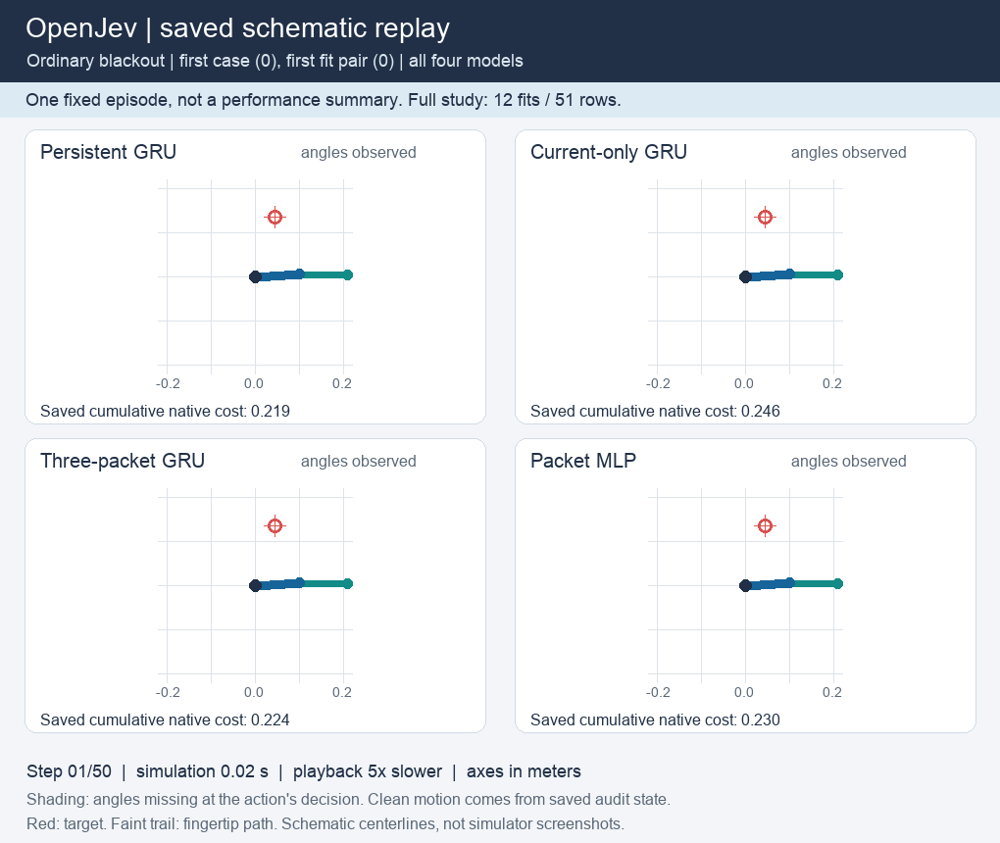

# Does persistent learned memory improve control?

**Completed: all 25 continuation checks passed.** Persistent recurrence reduced
mean native control cost by **9.27% on six-step observation gaps and 9.00% on
ten-step gaps**, compared with the trained current-packet GRU. Every paired fit
improved. On longer gaps, it also reduced mean cost by **6.51% versus the
three-packet GRU**, again improving every pair.

The evidence supports useful persistent information under this training recipe.
It does not establish a novel architecture or a biological advantage. A small
current-packet MLP was much closer, and the gains varied substantially by fit.
This comparison follows the [failed objective-ablation continuation
rule](reacher-objective-ablation.md). The earlier 5.8% mean latent-objective gain
was inconsistent across fits and did not establish useful memory. This study
tests that explanation before adding another architecture. The earlier failed
study remains a failure; this is a separate protocol with fresh fits and cases.

A subsequent [15-fit explicit-cache comparison](reacher-cache-ablation.md)
failed its stronger persistent-memory rule: 15/28 checks passed. Cached MLP
outperformed persistence on both gap panels in every paired fit. That result
does not alter this study's original criterion, but limits the case for adding
recurrent complexity based on it.

## Results and limits

Lower cost is better. Each learned value averages all three fits over the same
64 evaluation cases. The 51 control rows comprise 36 learned-model rows and
15 reference rows; they are not 51 independent datasets.

| Controller | Full sensing | Six-step gaps | Ten-step gaps |
| --- | ---: | ---: | ---: |
| Persistent GRU | 8.0852 | 8.0943 | 8.2282 |
| Current-packet GRU | 8.7266 | 8.9208 | 9.0419 |
| Three-packet GRU | 8.5729 | 8.6927 | 8.8010 |
| Current-packet MLP | 8.0583 | 8.1807 | 8.3726 |
| Supplied physics, known state | 7.6991 | 7.6991 | 7.6991 |
| Supplied physics, particle filter | 7.8020 | 7.8498 | 7.9125 |
| Supplied physics, public kinematics | 7.7072 | 7.7468 | 7.8256 |
| Zero action | 11.3728 | 11.3728 | 11.3728 |
| Uniform action | 42.7737 | 42.7737 | 42.7737 |

The mean gain over current-packet GRU is uneven. Pair 0 improves by
20.63%/21.58% on ordinary/long gaps; the other pairs improve by roughly
1.75%-3.78%. The MLP comparison is weaker: persistent GRU improves its family
mean by only 1.06%/1.72%, loses pair 1 on both gap panels, and has paired
descriptive intervals spanning zero. Those intervals condition on these
three fits and the shared training corpus; they do not quantify architecture
uncertainty across new training datasets. With full sensing, MLP has 0.33%
lower family mean cost. The supplied-physics references outperform the
persistent family on every panel.

Persistent recurrence already improves over current-packet GRU by 7.35% with
full angle sensing. Most of the absolute gap-panel advantage is therefore
present without blackouts. Full angle sensing still hides velocity; this
comparison does not isolate a benefit specific to bridging missing packets.

On the separate 96-episode prediction panel, mean one-step blackout prediction
MSE is 0.02857 for persistent GRU, 0.35833 for current-packet GRU, 0.22630 for
three-packet GRU and 0.38050 for MLP. This is error on four sine/cosine
components, not squared angular radians or velocity error. Clean blackout
targets are audit-only labels. The MLP's close control performance despite
much worse observation prediction is another reason not to equate prediction
quality with decision quality. There is no direct velocity-inference result.

A separate [post hoc reward diagnostic](../output/reacher-memory-ablation-v1/reward-bottleneck-diagnostic.md)
finds that persistent recurrence improves reward prediction much less than angle
prediction. On the same 96 exploration histories, reward MSE improves by 31.90%
versus the MLP; the control gain remains only 1-2% and inconsistent across fits.
Most remaining selected-action reward error lies in the learned distance
residual. This motivates a future reward-model intervention, but saved one-step
errors do not establish which unchosen action sequences the planner misranks.
The diagnostic changes neither the original result nor its continuation rule.

[Every fit, qualification check, prediction error and timing](../evidence/reacher-memory-ablation-v1/figures/tables.md)
is retained alongside the [saved-output audit](../evidence/reacher-memory-ablation-v1/audit/summary.json).
The [research release](https://github.com/kw2828/OpenJev/releases/tag/research-reacher-memory-ablation-v1)
provides the complete saved execution, model checkpoints, audit and reporting
artifacts. Capacity and rehearsal archives are separate engineering assets.
Historical lineage dependencies remain separate releases; the archive manifest
and protocol preserve their identities.
The native audit replayed 206,400 transitions with zero discrepancy, including
38,400 inherited training transitions, 4,800 fresh prediction transitions and
163,200 control transitions. It also checked 9,408 nominal public-observer
transitions. It did not rerun neural inference or optimizer updates.

## See the recorded behavior

This is a **schematic replay of case 0, pair 0**, showing all 50 steps at five
times slower playback. This fixed first case favors the MLP; it is not a
performance summary or a selected successful episode. Shading marks missing
angles at the controller's decision. The clean robot positions are drawn from
saved audit state, not observations supplied to the controller. Centerlines
use the recorded joint positions and frozen XML geometry; this is not a
simulator screenshot. The maximum coordinate difference from the saved native
fingertip displacement is 1.80 mm. [Replay receipt](../evidence/reacher-memory-ablation-v1/replay/receipt.json).

## Measured computation

The complete execution took **1,083.97 seconds**, including 554.55 seconds
across all fits and 519.14 seconds across all control rows. The separate
saved-output audit took 30.97 seconds. Measurements used CPU float32 with two
Torch threads on a shared Apple M5 Max host; these are not isolated latency
measurements or a FLOP-matched study.

| Model | All three fit walls, seconds | Ordinary whole-row ms per case/decision | Long-gap whole-row ms per case/decision | Explicit state bytes per case |
| --- | ---: | ---: | ---: | ---: |
| Persistent GRU | 92.71 | 2.199 | 2.231 | 288 |
| Current-packet GRU | 97.22 | 2.224 | 2.224 | 288 |
| Three-packet GRU | 267.67 | 2.679 | 2.684 | 419 |
| Current-packet MLP | 96.96 | 2.631 | 2.617 | 32 |

Whole-row times include controller setup, decisions, native stepping and
trace storage, amortized over 64 cases and 50 decisions; fitting and final
global hashing are separate. State bytes count explicit tensor payloads,
not peak resident memory. The MLP's small state does not imply a cheaper
implementation in this run. Different operations and shared-host effects
prevent a general speed ranking from these timings.

Learned controllers use 256 CEM candidate evaluations per decision; physics
references use the common initial 64 proposals and supplied dynamics. The
reference timing comparison does not isolate architecture or implementation
language. No Astra calls were made in this experiment.

## Comparison

| Arm | Information retained between real decisions | Imagined planning |
| --- | --- | --- |
| Persistent residual GRU | Complete learned recurrent history | Same GRU transitions and CEM256 |
| Current-packet GRU | Current packet only, including missingness and age | Same GRU transitions and CEM256 |
| Three-packet GRU | Last three real packets and two issued commands | Same GRU transitions and CEM256 |
| Current-packet MLP | Current packet only | Action-conditioned packet prediction and CEM256 |

The first three models have identical parameter sets and paired initial values.
The MLP has 36,599 parameters versus 36,805 for the GRU64, and an independently
named initialization. Every arm uses the same 768 training episodes, Anchor
sequence loss, 48 epochs and 1,152 optimizer updates per fit. There are three
paired fit identities and 12 fits in total. These are new fits; no prior final
weights are reused.

The current-packet models discard previous state during training as well as
deployment. This avoids treating a post-training state reset as evidence about
a model trained without history. The three-packet model reconstructs its state
from a strict physical-step window. It does not retain its own old predictions
through an observation gap.

All final models must restore with their actual classes, planned seed roles,
orders, public training data and optimizer state before any evaluation draw.
Evaluation uses 64 new paired control cases with full sensing, six-step gaps
and ten-step gaps, plus 96 separate prediction episodes. Every model uses the
same case-specific reset, actuator noise and search innovations. There is no
checkpoint or best-fit selection.

The 51 control rows include five references on each sensing panel: zero action,
uniform action, supplied physics with true state, a supplied-physics particle
filter, and a supplied-physics two-measurement estimator. The last estimator
uses wrapped angular displacement divided by actual elapsed time between valid
observations, then propagates nominal dynamics during gaps. It sees public
packets and issued commands, never true velocity or realized actuator noise.
It is a physical-knowledge competence reference, not a matched learned model.

## Frozen continuation rule

Persistent memory must satisfy all 25 checks:

- At least 5% lower family mean native cost than the trained current-packet GRU
  on both gap panels, with every paired fit strictly better: eight checks.
- At least 3% lower family mean cost than the three-packet GRU on the longer-gap
  panel, with no paired fit worse: four checks.
- No more than 2% worse full-sensing family mean cost than the current-packet
  GRU, and no worse than the MLP family mean on either gap panel: three checks.
- Every persistent fit at least 10% better than zero action on each gap panel:
  six checks.
- Known-state physics and the public-history particle filter each at least
  10% better than zero action on both gap panels: four checks.

Native cost is negative total native reward over the same 50 physical steps.
Lower is better. The kinematic reference is fully reported but is not a primary
continuation check. It helps assess whether conventional estimation explains
the result. Intervals and prediction errors are descriptive; neither can rescue
a failed continuation rule. The [frozen protocol](../evidence/reacher-memory-ablation-v1/protocol/plan.json)
has SHA-256 `05f09ee5425190f5d652aedb10af1641037035d85e906d04d86baf33552a5786`.
It permits one execution with a 3,600-second cap and a separate 300-second
saved-output audit, without retries, resumed fits or cap extensions.

## Cost and interpretation

Equal data and optimizer updates do not match computation. The three-packet
model reconstructs history at every real observation and the MLP has different
arithmetic. Report every fit's wall time, assimilation/reconstruction work,
planning work, state payload, trace storage and native stepping. Shared-host
batch timings are not isolated single-agent latency or full FLOP counts.

The pass establishes useful persistent public-history information under this
training recipe. Retaining the last valid angles could explain the gain;
the present erased-history controls do not isolate velocity inference. A
separate hold-last-angle comparator would be needed for that mechanism claim.
The gate does not establish a new architecture, useful Bayesian inference,
biological wiring or an ICLR contribution. If the shorter history or simple estimator explains the
gain, report that and avoid expanding the claim. Persistent hidden dynamics
need a separate, identifiable task before a slow-context or plastic-state
mechanism is justified. The next comparison should challenge recurrence with
explicit last-valid-angle and two-valid-measurement controls, following the
[primary-source review](reacher-hidden-motion-followup.md). Any later connectome claim needs matched conventional
and rewired controls, untouched confirmation cases and a second environment.

The new [runner](../scripts/reacher_memory_study.py),
[protocol](../src/openjev/research/reacher_memory_protocol.py) and
[independent audit](../scripts/audit_reacher_memory_study.py) first passed a complete
[rehearsal](../evidence/reacher-memory-rehearsal-v1/README.md) using engineering-only
namespaces, plus 300 implementation tests. The [capacity measurement](../evidence/reacher-memory-capacity-v1/README.md)
supports the chosen execution allowance, but is a short synthetic projection,
not a runtime guarantee. Those engineering checks are distinct from the
completed scientific execution reported above.
