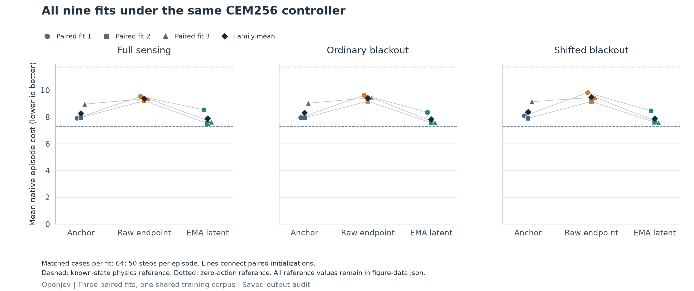

# Does latent prediction improve recurrent control?

**Completed and independently audited September 18, 2026. The frozen
continuation rule failed: 27/31 checks passed.** The
[launch receipt](../evidence/reacher-objective-ablation-v1/launch.json) identifies
the single execution attempt. This comparison holds the residual
GRU and CEM256 planner fixed, then changes the training objective. It follows the
[completed adaptive-search result](reacher-adaptive-search.md). It is a development
experiment, not a JEPA reproduction or a test of biological wiring.

## Result and decision

Latent prediction lowered mean native control cost by **5.76% on ordinary gaps
and 5.83% on longer gaps** versus Anchor, and **16.79% / 16.82%** versus Raw.
However, the first paired fit worsened against Anchor by **4.92% / 4.69%**.
Latent's mean history-reset penalties were only **1.87% / 2.19%**, below the
required 5%. Those four failures keep the overall criterion failed.

| Training objective | Full sensing | Ordinary gaps | Longer gaps | Mean whole-fit seconds |
| --- | ---: | ---: | ---: | ---: |
| Anchor | 8.2760 | 8.3123 | 8.3744 | 35.60 |
| Raw endpoint | 9.3721 | 9.4144 | 9.4801 | 120.30 |
| EMA latent | 7.8894 | 7.8339 | 7.8859 | 124.67 |

Cost is negative total native reward over 50 steps; lower is better. Each
entry averages all three paired fits and the same 64 evaluation cases. These
are development measurements in one environment, not an uncertainty estimate
over retraining. Raw worsened against Anchor in every fit, so its weakness
must remain visible when interpreting the larger latent-versus-raw gain.



[All paired changes, reset effects, timings and conditional intervals](../evidence/reacher-objective-ablation-v1/figures/README.md)
retain every fit. Latent took approximately **3.50 times Anchor's mean fitting
time** on the shared host, despite identical update counts. This comparison is
not a compute-matched training result. All deployed students use the same GRU
and CEM256; deployment timings include recorded trace writes and are batch
amortized.

Do not advance a useful-memory, biological-learning or JEPA novelty claim from
this result. The next diagnostic should train current-observation and strictly
bounded-history controls under the same Anchor loss before expanding the
architecture. If a later latent-objective comparison is justified, include
training-compute controls and fresh confirmation cases; do not change this
study's failed criterion or select its best fit.

The [saved-output audit](../evidence/reacher-objective-ablation-v1/audit/receipt.json)
authenticated all nine fits and 57 rows, and replayed **225,600 native
transitions with zero discrepancy**. It made no new learned-model calls.
Execution took **1,385.00 seconds**, the audit's validation took **34.61
seconds**, and the outer audit process took 35.70 seconds. Recorded cumulative
research execution, including inherited attempts, is 2,473.78 seconds;
engineering preparation, audits and publication are separately accounted.

### Descriptive prediction diagnostic

The common 96-episode prediction panel shows why prediction error and control
must stay separate. Family means from the authenticated audit are:

| Objective | One-step measured-angle MSE | One-step blackout-angle MSE | Seven-step angle MSE | One-step reward MSE |
| --- | ---: | ---: | ---: | ---: |
| Anchor | 0.006697 | 0.027910 | 0.115103 | 0.004557 |
| Raw | 0.004914 | 0.015107 | 0.052853 | 0.007090 |
| Latent | 0.007945 | 0.035387 | 0.115076 | 0.004835 |

Raw predicts angles more accurately but has worse reward prediction and worse
control. Latent's lower mean control cost does not coincide with lower angle
error. This descriptive comparison does not identify the cause: errors on
planner-selected actions, ranking errors and objective interactions remain
possible explanations. Native blackout angles are audit-only labels, never
policy inputs or hidden-state training targets. A future action-ranking study
needs its own paired native-outcome protocol; these metrics do not establish
better planning representations or useful memory.

| Arm | Training objective | Deployment |
|---|---|---|
| Anchor | Existing observation and reward loss | Student GRU + CEM256 |
| Raw | Anchor + future observation prediction | Same |
| Latent | Anchor + EMA-teacher future state prediction | Same |

There are three paired initializations and nine fits. Every fit uses the same
768 training episodes, 48 epochs, 1,152 optimizer updates and paired minibatch
orders. Raw and Latent share auxiliary horizons 1, 3 and 7, masks and 4,160 added
predictor parameters. Their gradient paths and training computation differ.
The teacher and predictor are excluded from deployment.

Auxiliary weights come from a frozen training-only gradient-norm rule. All nine
final checkpoints, including their optimizer and teacher state, must pass
authentication and restoration before collecting fresh evaluation data.
Evaluation covers 64 paired cases with full sensing, six missing observations
and ten missing observations, plus history-reset interventions. There are 45
learned controller rows, 12 reference rows and 96 fresh prediction episodes.

## Continuation rule

Latent prediction must reduce family mean native cost by at least 5% against
both Anchor and Raw on both gap panels, with no paired fit worse. Its history
reset must worsen family cost by at least 5%, with positive reset effects in
every fit. The separate zero-action and physics-reference checks also apply.
All 31 prespecified checks must pass; every fit is reported.

A reset penalty establishes intervention sensitivity, not an advantage over
a separately trained current-observation model. A positive result still needs
that comparator, a compute-matched Raw treatment, untouched confirmation cases
and a second environment. Connectome and rewired controls follow only after a
useful learning mechanism is established.

## Engineering evidence and fixed limits

The [preflight receipt](../evidence/reacher-objective-ablation-v1/preflight.json)
records **199 passing checks**. The full synthetic rehearsal ran nine tiny fits
and 57 control rows; its independent audit replayed **9,350 native transitions
with zero discrepancy**, while neural and optimizer calls were prohibited.
Synthetic inheritance checks replace production lineage only in this rehearsal.
The [complete engineering archive](https://github.com/kw2828/OpenJev/releases/download/research-reacher-objective-ablation-v1/engineering-whole-tree-v1.tar.gz)
contains the saved tree. These are implementation checks, not efficacy results.
The receipt also records the earlier failed engineering audit and its unavailable
temporary artifacts.

The size-matched capacity measurement projects 16 minutes of training. Earlier
controller timings project another 7.9 minutes of controls and references.
These estimates exclude remaining storage, prediction and restoration overhead.
The frozen limits are **3,600 seconds for execution and 300 seconds for audit**.
Preparation costs are reported separately from research execution costs.
There are no retries, replacement seeds, resumes or cap extensions.

The [host observation](../evidence/reacher-objective-ablation-v1/host-observation.json)
records an Apple M5 Max with 48 GiB of memory. This study uses two Torch threads;
a separate chess experiment is active on the same workstation. Report recorded
wall times as shared-host work and batch-amortized throughput, not isolated
single-case latency or FLOPs.

The [executable protocol](../evidence/reacher-objective-ablation-v1/protocol/plan.json)
binds all 42 source files, runtime, data lineage, random streams and criteria.
Its SHA-256 is:

```text
dca778153230375a5a0e790390d328d69857dd4c2d3260b61fb9f214fa1d32f2
```

The [original design](reacher-objective-ablation-draft.md) preserves the reasoning
and detailed limits. The [runner](../scripts/reacher_objective_study.py) and
[independent auditor](../scripts/audit_reacher_objective_study.py) are separate.
The auditor reconstructs recorded gradient norms, first/last EMA updates, costs
and native outcomes. It does not independently rerun every training update or
neural prediction.

The separate [report generator](../scripts/render_reacher_objective_results.py)
authenticates a completed audit before exporting all nine fits, raw-versus-anchor,
latent-versus-anchor and latent-versus-raw changes, reset penalties and cost
figures in PNG, SVG and PDF. Its numeric tables and receipt retain source
identities. [13 reporting checks](../evidence/reacher-objective-ablation-v1/reporter-engineering.json)
and a visually inspected, explicitly watermarked synthetic preview are complete.
The completed real figures above were generated after the research audit and
visually checked. The source-bound numeric tables and renderer receipt are
included alongside them.
