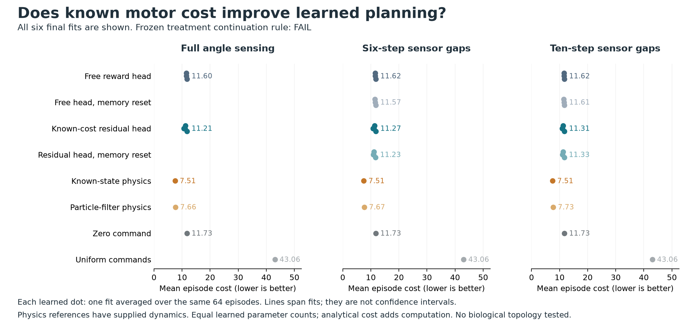
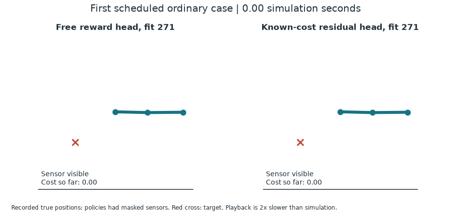
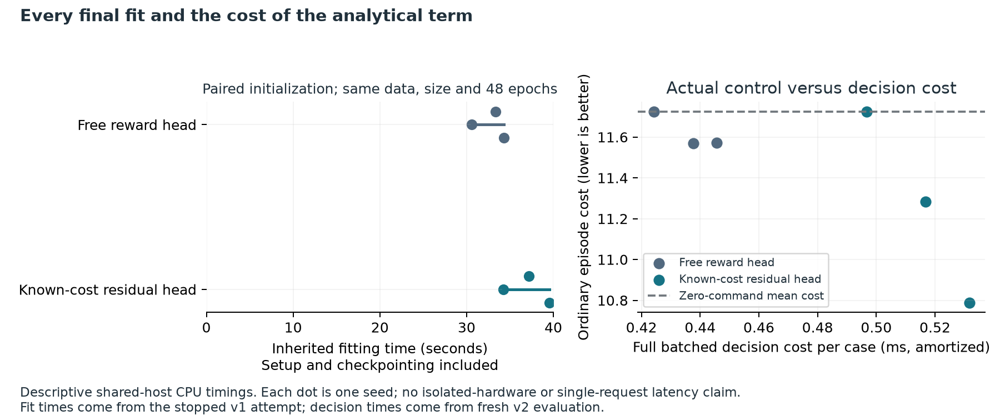

# Better reward prediction, small gains in robot reaching

**Completed: 9 of 17 continuation checks pass; the study fails its continuation
rule.** A known actuator-cost term improves prediction substantially, but lowers
ordinary control cost by only **3.1%**, and cost under longer sensor gaps by
**2.7%**. Memory resets show no consistent penalty. This does not establish a
memory or connectome advantage.



[Complete report and CSVs](../evidence/reacher-reward-residual-control-v2/report/report.md)
· [Independent audit](../evidence/reacher-reward-residual-control-v2/audit/README.md)
· [All weights and execution records](https://github.com/kw2828/OpenJev/releases/tag/research-reacher-reward-residual-control-v2)
· [Frozen protocol](../evidence/reacher-reward-residual-control-v2/protocol/plan.json)

## What changed

Both models use the same small GRU. The free reward head predicts total native
reward. The residual head subtracts the known expected squared actuator cost
from its learned output. It uses the issued command and the known noise level,
without observing the realized disturbance, true velocity or separate distance
reward. This is a conventional use of known reward structure.

All six final models were inherited unchanged from the
[stopped v1 experiment](reacher-reward-residual-pilot.md): two reward heads,
each at seeds 271, 283 and 293. Training used the same 768 episodes, 48 epochs,
paired initialization and minibatch order. No new training, checkpoint selection
or model pruning occurred.

The [random-stream correction](reacher-rng-independence-correction.md) fixes
cross-role seed aliases in the old evaluation. This new evaluation used 96
common prediction episodes and 64 paired control cases per sensing panel.
Every learned planner scores 64 candidates over a 12-step horizon. It retains
all original seventeen criteria, full sensing, six-step gaps, ten-step shifted
gaps, reset diagnostics and four reference controllers.

## Results

Mean episode cost, lower is better. Learned rows average all three fits; each
fit sees the same 64 cases. Physics references have supplied dynamics. Their
privileged access and higher computation are reported separately.

| Sensing panel | Free reward head | Known-cost residual | Zero command | Known-state physics | Particle-filter physics |
|---|---:|---:|---:|---:|---:|
| Full sensing | 11.601 | 11.207 | 11.725 | 7.505 | 7.665 |
| Six-step gaps | 11.622 | 11.266 | 11.725 | 7.505 | 7.675 |
| Ten-step gaps | 11.622 | 11.307 | 11.725 | 7.505 | 7.728 |

Residual cost is lower than its paired free-head fit in all six ordinary/shift
comparisons, although one difference is only 0.0006. Neither panel achieves the
required 5% family-mean improvement. None of the six residual fit/panel cases
achieves the required 10% improvement over zero commands.

On the common prediction cohort, mean reward MSE falls from **0.006226 to
0.004400**, a **29.3%** reduction. One-step angle-feature MSE falls from
**0.016392 to 0.006150**, a **62.5%** reduction. These angle targets are sine and
cosine features, not angles in radians. The fit with the lowest prediction
error largely selects zero commands; better prediction alone has not supplied
competent action selection.

Paired residual-minus-free cost differences are -0.356 on ordinary cases
(episode-bootstrap 95% interval -0.567 to -0.172), and -0.315 under shift
(-0.524 to -0.137). These intervals are conditional on the six inherited fits
at three paired seeds. They do not estimate variation over new model fits.

Resetting residual memory changes mean cost by -0.036 on ordinary cases and
+0.024 under shift. Both intervals span zero. The free-head reset is helpful
on ordinary cases. There is no consistent evidence that retained memory
improves control in this experiment.

## Recorded replay



This schematic replays recorded true arm positions from case zero and seed 271,
without choosing a successful episode. Policies received masked observations;
the displayed true positions were unavailable to them. The red cross is the
target. Playback is twice as slow as the one-second simulated episode. The
[still image](../evidence/reacher-reward-residual-control-v2/figure/reacher-first-case.png)
and [rendering receipt](../evidence/reacher-reward-residual-control-v2/figure/receipt.json)
are also available. Rendering makes no new policy or model calls.

## Costs and verification



| Cost | Seconds |
|---|---:|
| Six inherited fits | 209.15 |
| Prior invalid attempt, including those fits | 359.14 |
| Fresh evaluation | 247.42 |
| Actual cumulative attempt time | 606.56 |
| Separate audit validation | 12.54 |

The fresh evaluation includes 236.40 seconds of control setup and decisions.
The actual cumulative total includes the failed attempt once; fitting is not
added again. Audit validation excludes its final rehashing/publication writes.
Shared-host CPU timings are descriptive. Per-case decision costs in the figure
are amortized over batches, not isolated single-request latency.

The completed independent audit authenticates every inherited model and saved
artifact, verifies pairing and the stream manifest, and replays **177,600 native
transitions with maximum absolute error 0.0**. It recomputes scores without new
learned inference, policy decisions, fitting or MPC. The manifest enumerates
692 root allocations and 820 concrete generator identities, checking all roles
against original training and both old evaluations. Distinct seeds and states
prevent the demonstrated aliases; they do not prove mathematical independence
of pseudorandom sequences.

The frozen engineering suite passed 119 checks. The separate report has 29
checks. These establish artifact and implementation checks, not useful control.
All 42 controller/panel rows and all 288 historical training rows are published.
The complete execution archive contains 172 authenticated files, including all
weights, planning records and trajectories. Its
[manifest](../evidence/reacher-reward-residual-control-v2/archive.json) records
the archive hash and reproduction requirements.

Protocol SHA-256:
`4c21a1505245314a923325ca0aae141daed6a737170d870272860bd00857561f`.
Audit receipt SHA-256:
`af87d1e4f1aa4bfe72a2730e6d33c1a6a455b573ea4fb27c240812bc61c434dd`.
Protocol commit: `97c14ac`. Implementation commit: `727d473`.

### Reproduce the saved-output audit

Use a checkout containing the published protocol and source, and the exact
[recorded runtime](../research/robotics-requirements.txt). The frozen validator
also checks the recorded Python/platform/native-source identity, so a different
machine is a porting exercise rather than an identical audit.

Verify both release archives against their manifests before extraction. Extract
this release under `runs/reacher-reward-residual-control-v2/`, producing its
`execution/` directory. Extract the
[original world-model archive](https://github.com/kw2828/OpenJev/releases/download/research-reacher-world-model-v1/reacher-world-model-v1-execution.tar.gz)
under `runs/reacher-world-model-v1/`; its original completion receipt and training
files are required to authenticate the inherited corpus. That original
evaluation retains its documented independence defect.

The auditor also requires the stopped residual-v1 fit source at its original
relative path. In a clean checkout, create
`runs/reacher-reward-residual-v1/execution/` and copy these bytes from the new
v2 `execution/` directory, without overwriting existing evidence:

| V2 source | Destination inside residual-v1 `execution/` |
|---|---|
| `fits/` | `fits/` |
| `source-all-fits-completed.json` | `all-fits-completed.json` |
| `source-failed.json` | `failed.json` |

This restores only the archived inputs needed by the auditor, not the stopped
attempt's partial evaluation. Do not create a residual-v1 completion receipt.
The repository already contains the three ancestor protocol/provenance records.
From the repository root, using the pinned runtime:

```sh
python scripts/reacher_reward_residual_control.py audit \
  --plan evidence/reacher-reward-residual-control-v2/protocol/plan.json \
  --expected-plan-sha256 4c21a1505245314a923325ca0aae141daed6a737170d870272860bd00857561f \
  --execution runs/reacher-reward-residual-control-v2/execution \
  --out output/reacher-residual-v2-reproduced-audit
```

The output path must be new. This replays saved native transitions and recomputes
metrics; it does not run learned policies or train models. Audit timing and its
containing receipt hash will differ on a new execution.

## Next experiment

The [planning literature review](reacher-planning-prior-work.md) motivates a
matched-budget comparison: one bank of 256 sequences versus four adaptive
search iterations of 64, with the existing 64-candidate bank as a cheaper
reference. Keep all six models, horizon, objective and action blocks fixed;
count anchors, proposal updates and any final scoring. Test native action
ranking on common states as well as closed-loop cost, so more optimistic
predictions cannot be mistaken for improved control.

This is a proposed, separately frozen experiment. It is not a result or an
architecture contribution. The [longer research direction](connectome-robotics-next-experiments.md)
tests fast/slow recurrent state and biological versus rewired connectivity only
after useful control and a demonstrated need for persistent memory.
