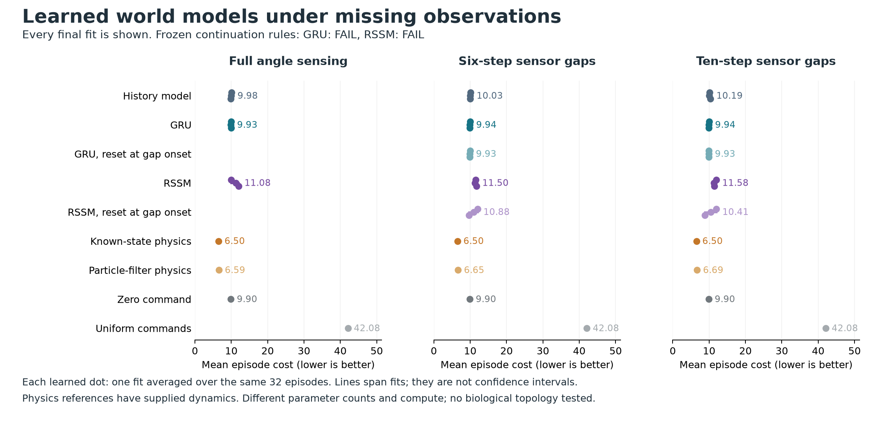
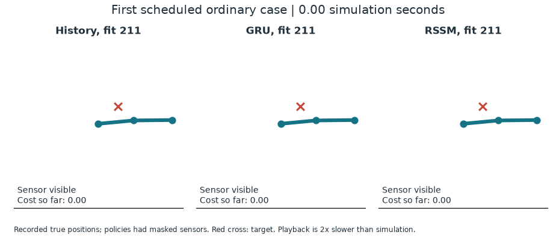

# Learned world models for reaching with missing sensors

**Correction, September 18, 2026:** a cross-role seed collision coupled planner
samples and hidden actuator noise in this study. The recorded scores and replay
audit remain factual, but the intended independent-disturbance protocol was
not met. Treat the following as descriptive outputs, not a valid independent
control qualification. See the [defect and recovery plan](reacher-rng-independence-correction.md).
The original source, protocol, audit and raw archive are preserved.

This pilot asks whether a trained recurrent world model improves control when
joint observations disappear. It follows the [literature review](connectome-world-model-robotics-reading.md)
and the [closed Pendulum qualification](robotics-pendulum-qualification.md).
It is a conventional baseline experiment, not evidence for biological wiring
or a new reinforcement-learning algorithm.

## Result: neither recurrent model qualified

All nine fits completed in **212.11 seconds** of total execution. The independent
audit replayed **124,800 native physical transitions** and accepted the saved
evidence. Scientific continuation failed: **1 of 27 checks passed**, solely the
supplied-physics controller's competence check.

Mean episode cost, lower is better. Learned rows average all three fits, each
evaluated on the same 32 cases; these are not confidence intervals.

| Controller | Six-step gaps | Ten-step gaps |
|---|---:|---:|
| History model | 10.025 | 10.187 |
| GRU | 9.940 | 9.940 |
| GRU, reset at gap onset | 9.926 | 9.925 |
| Gaussian RSSM | 11.500 | 11.579 |
| RSSM, reset at gap onset | 10.879 | 10.408 |
| Known-state physics | 6.504 | 6.504 |
| Particle-filter physics | 6.652 | 6.690 |
| Zero command | 9.900 | 9.900 |
| Uniform commands | 42.082 | 42.082 |

The learned models do not improve over zero commands. Resetting memory does
not hurt mean control cost. The physics references show useful control is
possible with supplied dynamics; they do not establish that our learned model
or public observation interface is sufficient to recover that performance.

This schematic replay uses recorded physical positions from **case 0, fit seed
211** for every model. Red crosses are targets; shading marks missing sensors.
Playback is twice as slow as simulation. The models received masked joint
observations, not the true positions used to draw the replay. The near-static
history/GRU behavior is part of the failed result, not a successful demo.

### What the saved outputs suggest

All models beat angle persistence at five-step prediction, but lose at one
step. Mean five-step angle MSE is 0.1495 for history, 0.1830 for GRU, 0.1848
for RSSM, versus 0.2176 for persistence. Prediction improvement alone did not
produce useful control.

Training had not plateaued: epoch 9 to 12 loss fell 29-32% for history, 48-61%
for GRU and 30-33% for RSSM. That motivates a longer fixed budget in a new
experiment, without proving it will help. GRU chose exactly zero commands on
89-99% of ordinary steps. All history and GRU fits chose zero on every first
step, while the supplied-physics planner chose nonzero on 21 of 32 paired
initial cases. Later trajectories differ and cannot support the same direct
candidate comparison. No selected one-step reward prediction was positive,
so saturation at the planner's zero reward ceiling is not the immediate
explanation. These are [post-hoc saved-output diagnostics](../evidence/reacher-world-model-v1/diagnosis.json),
not new trained comparators or causal proof.

The [next narrow test](reacher-reward-residual-pilot.md) is an identical GRU that predicts residual task reward
while a fixed analytical term supplies expected noisy actuator cost. Both it
and a free reward-head baseline should receive the same prospectively longer
training budget, data and planner, with fresh fit and evaluation seeds. Train
against native total reward only. This conventional reward-structure prior
must first improve actual control; it is not a novel architecture or a reason
to bypass the failed memory qualification and start a connectome sweep.

## Task and information

Use Gymnasium Reacher-v5 with its native 50-step horizon, reset distribution,
physical model and distance-plus-action reward. Both reward weights are set
explicitly to 1, matching the [version 1.3.0 constructor](https://github.com/Farama-Foundation/Gymnasium/blob/v1.3.0/gymnasium/envs/mujoco/reacher_v5.py).
The prose documentation says the action weight is 0.1; the installed and tagged
code say 1. The code is authoritative for this experiment.

The modified observation interface exposes angle cosine/sine, a static target,
a validity bit and sensor age. It removes velocities and fingertip-to-target
displacement, including indirect clues during observation gaps. Missing angles
are zero placeholders with validity false. Two gaps last six decisions during
training and ordinary evaluation, and ten during shifted evaluation. The
native time step is 0.02 seconds.

Independent Gaussian actuator noise, standard deviation 0.05, is added after
command clipping and before applied-action clipping. The native reward uses
the applied action. Its value is a training target, never a deployed model
input. This is a documented partial-observation variant, not an unmodified
Reacher leaderboard result.

## Models and training

Compare an autoregressive history MLP, a GRU world model and a small Gaussian
recurrent state-space model. The first retains a 12-step window of measurements,
estimates and actions. Predicted estimates can feed subsequent predictions
with validity false; its effective memory is not strictly limited to 12 steps.
It is deliberately stronger than a window that forgets everything during
imagination. The GRU and RSSM separately assimilate real observations and
advance state under candidate actions. RSSM evaluation uses distribution means,
so this does not test uncertainty-aware planning.

All three receive the same 768 exploratory episodes, 12 epochs, 32 episodes per
batch, Adam at 0.001, and three paired seeds. There are nine fits, each with 288
updates. Train on observed next angles and executed reward, plus a five-step
open-loop prediction loss. Missing angle targets are masked. No hidden velocity,
simulator-state target or expert action label enters the learning loss.

Half the collection episodes use a supplied-physics inverse-kinematics/PD
controller with exploration noise. The remainder use two scales of held random
actions. This provides shared behavior coverage; the collector's privileged
information is disclosed rather than attributed to model learning. Prediction
evaluation uses 96 separate episodes. Only final checkpoints are evaluated.

Parameter counts differ: history 32,645, GRU 36,805, RSSM 40,709. Equal data and
updates are not equal computation or capacity. Report full decision timing and
these counts; do not call this an exactly capacity-matched architecture test.

## Control and continuation rule

Evaluate every fit on 32 paired untouched cases under full angle sensing,
ordinary gaps and longer gaps. Use identical candidate action plans, a 12-step
horizon and 64 candidates. Predicted rewards are clipped to the physical range
[-2.5, 0]; there is no terminal value. This is learned-model predictive control,
not online policy-gradient training.

References use the native physical model with either true current state or a
32-particle estimator that receives only public history. The particle estimator
uses a known noise distribution, approximate observation weighting and angle
reanchoring. It is not an exact Bayesian filter. Both plan under zero future
disturbance and have additional model knowledge. Zero and uniform actions are
floors. GRU/RSSM interventions clear learned memory at blackout onset.

Advance a recurrent kind only if the known-state reference is competent, every
fit improves on zero-action control by at least 10%, mean cost improves over
the history model by at least 5% in ordinary and shifted panels, memory reset
increases mean cost by at least 5% in both, and every fit beats angle persistence
by at least 10% on masked one-step prediction error. All cases and fit seeds
remain in the report. Episode bootstrap intervals are descriptive and do not
replace training-seed uncertainty.

The complete run has a cooperative 30-minute cap and no retries, replacement seeds,
extensions, checkpoint selection or test-based tuning. All fits complete before
control evaluation. Checks occur between optimizer batches, prediction roots,
control steps and native-MPC cases; an individual native operation is not
preempted. An over-cap execution cannot report success. Failure preserves its
evidence and does not justify a
connectome sweep. A later topology experiment needs its own protocol and
matched biological, rewired and conventional dynamics.

This comparison follows the need for strong recurrent controls emphasized by
[Ni et al.](https://arxiv.org/abs/2110.05038) and the distinction between filtering
and control illustrated by [Recurrent Kalman Networks](https://arxiv.org/abs/1905.07357).
Neither this small RSSM nor the particle estimator reproduces those systems.

## Runtime and evidence

The [isolated dependency lock](robotics-requirements.txt) leaves the live chess
runtime unchanged. The frozen protocol binds source files, package versions,
native task source and XML. The audit uses saved trajectories, predictions,
candidate scores and weights. It replays physical transitions and recomputes
metrics without new training or planner decisions. On-policy prediction errors
are reported separately because a planner can exploit errors that are rare in
the exploratory prediction set.

The [frozen protocol](../evidence/reacher-world-model-v1/protocol/plan.json)
has SHA-256 `10b9d22aaaa178c8293908f1d096a29ed7994760c997372dc865d240c224133b`.
Implementation commit: `1b41b0a`. All 120 engineering checks passed, including
a separate tiny training/control/audit fixture.

[Audit and every continuation check](../evidence/reacher-world-model-v1/audit/summary.json)
and [audit receipt](../evidence/reacher-world-model-v1/audit/receipt.json) are
published with the figures. The [complete execution archive](https://github.com/kw2828/OpenJev/releases/download/research-reacher-world-model-v1/reacher-world-model-v1-execution.tar.gz)
includes all nine final weights, training curves, exploratory data, prediction
outputs, control trajectories and planning scores. Verify it against the
[archive manifest](../evidence/reacher-world-model-v1/archive.json) before
extracting. This includes failed scientific results, not selected successes.

The audit checked source/runtime identity, member hashes, weight structure,
saved score consistency and physical transitions. It did not rerun training
or learned model inference. The figures and diagnosis add no model, policy or
physics calls. Their scripts and source hashes are published separately from
the frozen experiment.
