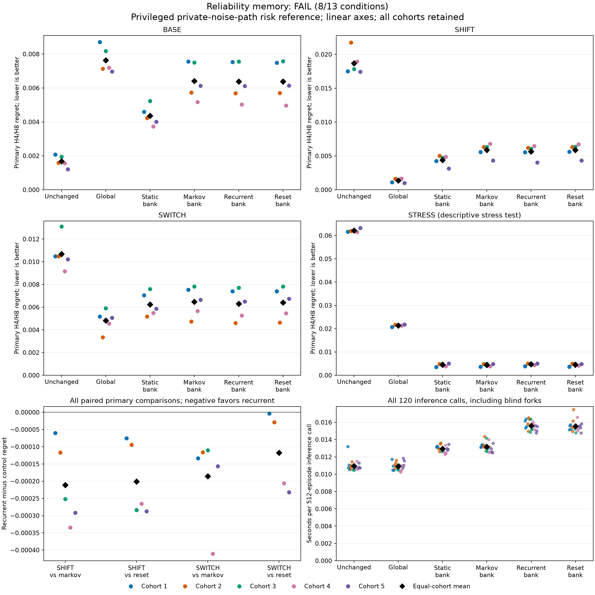

# Causal observation-reliability memory

**FAIL: 8/13 prospective continuation conditions passed.** This recipe did not meet the fixed continuation rule. No control, cohort or threshold was changed after evaluation.

The candidate adds a four-unit recurrent reliability gate to a three-mode Bayesian filter. The primary controls are a learned constant-switching Markov filter and a matched stored-size gate whose GRU memory is reset at each event. The Markov control performs exact filtering for its assumed mode-transition law.

Primary regret averages H4/H8 blind-fork regret within each episode over alive boundaries at event index 8 or later, then over supported episodes and equally over five cohorts. Lower is better. The reference knows the private realized noise path: this is conditional expected-cost risk, not an attainable public-history Bayes floor or a calibration guarantee.

| Stratum | Unchanged | Global | Static bank | Markov bank | Recurrent bank | Reset bank |
|---|---:|---:|---:|---:|---:|---:|
| BASE | 0.00167911 | 0.00763974 | 0.00436496 | 0.00641826 | 0.00638551 | 0.00637664 |
| SHIFT | 0.0186966 | 0.0013833 | 0.0044008 | 0.00587496 | 0.00566423 | 0.00586543 |
| SWITCH | 0.0106898 | 0.00481474 | 0.00622953 | 0.00648427 | 0.00629889 | 0.00641615 |
| STRESS | 0.0621104 | 0.021355 | 0.00445614 | 0.00444263 | 0.00469005 | 0.00451838 |

| Primary comparison | Recurrent mean | Control mean | Relative reduction | Paired wins |
|---|---:|---:|---:|---:|
| SHIFT vs markov_bank | 0.00566423 | 0.00587496 | 3.59% | 5/5 |
| SWITCH vs markov_bank | 0.00629889 | 0.00648427 | 2.86% | 5/5 |
| SHIFT vs reset_bank | 0.00566423 | 0.00586543 | 3.43% | 5/5 |
| SWITCH vs reset_bank | 0.00629889 | 0.00641615 | 1.83% | 5/5 |

Mean inference calls: recurrent **0.0155998s**, Markov **0.0131658s**. BASE event NLL: recurrent **0.725758**, Markov **0.725432** nats.

Every original condition is retained below. SHIFT and SWITCH each require a 10% equal-cohort mean reduction and strict wins in at least 4/5 cohorts against both primary controls. BASE noninferiority against both primary controls and the unchanged backbone, inference time and BASE event NLL are additional requirements; STRESS is descriptive.

| Fixed condition | Outcome |
|---|---|
| `all_strata/inference_time2x` | PASS |
| `base/event_nll_plus001` | PASS |
| `base/markov_bank/noninferiority` | PASS |
| `base/reset_bank/noninferiority` | PASS |
| `base/unchanged/noninferiority` | FAIL |
| `shift/markov_bank/mean_gain10pct` | FAIL |
| `shift/markov_bank/paired_wins4of5` | PASS |
| `shift/reset_bank/mean_gain10pct` | FAIL |
| `shift/reset_bank/paired_wins4of5` | PASS |
| `switch/markov_bank/mean_gain10pct` | FAIL |
| `switch/markov_bank/paired_wins4of5` | PASS |
| `switch/reset_bank/mean_gain10pct` | FAIL |
| `switch/reset_bank/paired_wins4of5` | PASS |

All arms use the same five frozen `rounded_mse` backbones, one from every original parent cohort. Each backbone stores 352 learned parameters. The supplied emission family and bank are structural prior knowledge, not inferred task structure. No active noise level, switch index or privileged target enters a learner. Precommitted fork actions are public controls.

| Arm | Added trainable parameters | Persistent state scalars |
|---|---:|---:|
| unchanged | 0 | 8 |
| global | 1 | 8 |
| static_bank | 0 | 24 |
| markov_bank | 4 | 24 |
| recurrent_bank | 164 | 28 |
| reset_bank | 164 | 28 |

The reset control stores 164 parameters, but 48 recurrent matrix entries always multiply zero. Stored size is matched; effective capacity is not. State counts exclude flags and temporary work.

Four arms were fitted per cohort, for 20 fits total. Every fit used 256 Adam updates of 64 public episodes, learning rate 0.01 and gradient clipping 5, with CPU float64 and one numerical thread. The only training loss was actual observed-event NLL, including first found and excluding absorbing padding. All 30 final model states preceded evaluation generation. Each cohort had 512 TRAIN episodes and 512 fresh episodes per evaluation stratum, with 32 actions plus reset; all first-found episodes were retained.

Original native wall time: qualification **3.52456s**, scientific run **76.8105s**, audit **4.15349s**. Original qualification passed **141 tests** with **0 warnings**.

Fit times include initial/final state and final Adam persistence, update logging and final checks. They exclude outer model construction and the final fits journal. Inference times include the episode filter and all blind forks, but exclude array conversion, prediction file writing and metric calculation. Native phase times include those surrounding costs. These are single-machine timings, not matched FLOPs or independently retimed audit measurements.

Every trained fit and complete measured fit time

| Cohort | Arm | Seed | Updates | Seconds |
|---:|---|---:|---:|---:|
| 1 | global | 438261001 | 256 | 2.05546 |
| 1 | markov_bank | 438261001 | 256 | 1.78797 |
| 1 | recurrent_bank | 438261001 | 256 | 2.80471 |
| 1 | reset_bank | 438261001 | 256 | 2.72998 |
| 2 | markov_bank | 438261002 | 256 | 1.84152 |
| 2 | recurrent_bank | 438261002 | 256 | 2.7484 |
| 2 | reset_bank | 438261002 | 256 | 2.79908 |
| 2 | global | 438261002 | 256 | 1.51498 |
| 3 | recurrent_bank | 438261003 | 256 | 2.78344 |
| 3 | reset_bank | 438261003 | 256 | 2.77631 |
| 3 | global | 438261003 | 256 | 1.63904 |
| 3 | markov_bank | 438261003 | 256 | 1.79392 |
| 4 | reset_bank | 438261004 | 256 | 2.78622 |
| 4 | global | 438261004 | 256 | 1.51495 |
| 4 | markov_bank | 438261004 | 256 | 1.83642 |
| 4 | recurrent_bank | 438261004 | 256 | 2.77582 |
| 5 | global | 438261005 | 256 | 1.51101 |
| 5 | markov_bank | 438261005 | 256 | 1.83364 |
| 5 | recurrent_bank | 438261005 | 256 | 2.73617 |
| 5 | reset_bank | 438261005 | 256 | 2.72087 |

All 120 audited cohort/arm/stratum rows

| Cohort | Arm | Stratum | Primary | H4 | H8 | Immediate | Event NLL | Supported / 512 | Late boundaries | Inference s |
|---:|---|---|---:|---:|---:|---:|---:|---:|---:|---:|
| 1 | unchanged | base | 0.00208017 | 0.00227104 | 0.0018893 | 0.00281495 | 0.692414 | 482 | 11110 | 0.0131919 |
| 1 | global | base | 0.00871518 | 0.00883903 | 0.00859133 | 0.0102678 | 0.769861 | 482 | 11110 | 0.0117335 |
| 1 | static_bank | base | 0.00460342 | 0.00471894 | 0.00448791 | 0.00569431 | 0.718925 | 482 | 11110 | 0.0131328 |
| 1 | markov_bank | base | 0.00755692 | 0.00791653 | 0.00719732 | 0.00852202 | 0.722068 | 482 | 11110 | 0.0131077 |
| 1 | recurrent_bank | base | 0.00753752 | 0.00774073 | 0.00733431 | 0.00852949 | 0.722615 | 482 | 11110 | 0.0161433 |
| 1 | reset_bank | base | 0.00748764 | 0.00778525 | 0.00719002 | 0.00841312 | 0.722086 | 482 | 11110 | 0.0151469 |
| 1 | unchanged | shift | 0.0174917 | 0.0185618 | 0.0164216 | 0.0211612 | 1.22896 | 475 | 10902 | 0.0107332 |
| 1 | global | shift | 0.0011182 | 0.00123947 | 0.000996939 | 0.00155332 | 1.11878 | 475 | 10902 | 0.0104905 |
| 1 | static_bank | shift | 0.00423374 | 0.00437174 | 0.00409575 | 0.00514052 | 1.13301 | 475 | 10902 | 0.0132245 |
| 1 | markov_bank | shift | 0.00559496 | 0.0057113 | 0.00547862 | 0.00619633 | 1.13632 | 475 | 10902 | 0.0131418 |
| 1 | recurrent_bank | shift | 0.00553516 | 0.00558732 | 0.005483 | 0.00597247 | 1.13631 | 475 | 10902 | 0.0153342 |
| 1 | reset_bank | shift | 0.00561069 | 0.0056658 | 0.00555559 | 0.00608801 | 1.13628 | 475 | 10902 | 0.0156047 |
| 1 | unchanged | switch | 0.0104799 | 0.0110118 | 0.00994804 | 0.0124739 | 0.962348 | 476 | 10864 | 0.0110619 |
| 1 | global | switch | 0.0051883 | 0.00551029 | 0.00486632 | 0.00535412 | 0.947129 | 476 | 10864 | 0.0109576 |
| 1 | static_bank | switch | 0.00704429 | 0.00727304 | 0.00681554 | 0.00785057 | 0.948868 | 476 | 10864 | 0.0131985 |
| 1 | markov_bank | switch | 0.00754073 | 0.00802195 | 0.00705951 | 0.00850217 | 0.943305 | 476 | 10864 | 0.013399 |
| 1 | recurrent_bank | switch | 0.00740738 | 0.00788486 | 0.00692989 | 0.00811989 | 0.943043 | 476 | 10864 | 0.016375 |
| 1 | reset_bank | switch | 0.00741083 | 0.00795436 | 0.0068673 | 0.00844145 | 0.943348 | 476 | 10864 | 0.0157156 |
| 1 | unchanged | stress | 0.0616328 | 0.0645593 | 0.0587062 | 0.0721775 | 1.86516 | 491 | 11215 | 0.010539 |
| 1 | global | stress | 0.0206789 | 0.0218244 | 0.0195335 | 0.0233983 | 1.55396 | 491 | 11215 | 0.010454 |
| 1 | static_bank | stress | 0.00357342 | 0.00368489 | 0.00346194 | 0.00402444 | 1.45894 | 491 | 11215 | 0.0130327 |
| 1 | markov_bank | stress | 0.00366381 | 0.00379153 | 0.0035361 | 0.00423171 | 1.46613 | 491 | 11215 | 0.0133971 |
| 1 | recurrent_bank | stress | 0.00388995 | 0.00393843 | 0.00384146 | 0.00441054 | 1.46685 | 491 | 11215 | 0.0155128 |
| 1 | reset_bank | stress | 0.00369255 | 0.00380117 | 0.00358393 | 0.00424315 | 1.46629 | 491 | 11215 | 0.0151995 |
| 2 | unchanged | base | 0.00159979 | 0.00174352 | 0.00145606 | 0.00185318 | 0.700629 | 469 | 10725 | 0.010912 |
| 2 | global | base | 0.00714016 | 0.00782516 | 0.00645516 | 0.00820738 | 0.775451 | 469 | 10725 | 0.011053 |
| 2 | static_bank | base | 0.00423328 | 0.00467954 | 0.00378702 | 0.00479471 | 0.727162 | 469 | 10725 | 0.0129412 |
| 2 | markov_bank | base | 0.0057262 | 0.00609605 | 0.00535634 | 0.00675318 | 0.729802 | 469 | 10725 | 0.0131705 |
| 2 | recurrent_bank | base | 0.00569234 | 0.00605241 | 0.00533227 | 0.0067042 | 0.729961 | 469 | 10725 | 0.0158388 |
| 2 | reset_bank | base | 0.00570052 | 0.00607559 | 0.00532545 | 0.00675318 | 0.729775 | 469 | 10725 | 0.0154233 |
| 2 | unchanged | shift | 0.0217432 | 0.0228465 | 0.02064 | 0.0253906 | 1.23472 | 467 | 10668 | 0.0106259 |
| 2 | global | shift | 0.00164031 | 0.00174104 | 0.00153958 | 0.00211874 | 1.12267 | 467 | 10668 | 0.0106998 |
| 2 | static_bank | shift | 0.00501556 | 0.00508574 | 0.00494538 | 0.005862 | 1.13593 | 467 | 10668 | 0.0126124 |
| 2 | markov_bank | shift | 0.00633373 | 0.0065822 | 0.00608525 | 0.00762688 | 1.13885 | 467 | 10668 | 0.0133476 |
| 2 | recurrent_bank | shift | 0.00621732 | 0.00645559 | 0.00597905 | 0.00727927 | 1.13883 | 467 | 10668 | 0.014963 |
| 2 | reset_bank | shift | 0.00631185 | 0.00653845 | 0.00608525 | 0.00762688 | 1.13889 | 467 | 10668 | 0.0149437 |
| 2 | unchanged | switch | 0.0104766 | 0.0110647 | 0.00988852 | 0.0120537 | 0.948993 | 487 | 10986 | 0.0110106 |
| 2 | global | switch | 0.0033551 | 0.00346552 | 0.00324469 | 0.00383007 | 0.933889 | 487 | 10986 | 0.011301 |
| 2 | static_bank | switch | 0.00517585 | 0.00541185 | 0.00493984 | 0.0061871 | 0.936139 | 487 | 10986 | 0.0134865 |
| 2 | markov_bank | switch | 0.00472995 | 0.00477883 | 0.00468107 | 0.00579407 | 0.927621 | 487 | 10986 | 0.0143639 |
| 2 | recurrent_bank | switch | 0.0046139 | 0.00471932 | 0.00450848 | 0.00569048 | 0.927356 | 487 | 10986 | 0.0165295 |
| 2 | reset_bank | switch | 0.00464246 | 0.00474118 | 0.00454374 | 0.00586757 | 0.927693 | 487 | 10986 | 0.0161452 |
| 2 | unchanged | stress | 0.0619129 | 0.0659102 | 0.0579155 | 0.0742659 | 1.86511 | 488 | 11088 | 0.01143 |
| 2 | global | stress | 0.0217313 | 0.0227342 | 0.0207284 | 0.0255035 | 1.55276 | 488 | 11088 | 0.0116149 |
| 2 | static_bank | stress | 0.004879 | 0.0049356 | 0.00482239 | 0.00513664 | 1.45685 | 488 | 11088 | 0.0135928 |
| 2 | markov_bank | stress | 0.0048365 | 0.00500892 | 0.00466407 | 0.00536752 | 1.4659 | 488 | 11088 | 0.0130882 |
| 2 | recurrent_bank | stress | 0.00507672 | 0.00530568 | 0.00484777 | 0.00562556 | 1.46739 | 488 | 11088 | 0.0163446 |
| 2 | reset_bank | stress | 0.00489339 | 0.00507156 | 0.00471523 | 0.00541279 | 1.46602 | 488 | 11088 | 0.0174695 |
| 3 | unchanged | base | 0.00194514 | 0.00209944 | 0.00179084 | 0.00237725 | 0.702719 | 484 | 11149 | 0.010476 |
| 3 | global | base | 0.00817904 | 0.00833049 | 0.00802759 | 0.00966577 | 0.777949 | 484 | 11149 | 0.0105257 |
| 3 | static_bank | base | 0.00523883 | 0.00577506 | 0.0047026 | 0.00631104 | 0.729334 | 484 | 11149 | 0.0126374 |
| 3 | markov_bank | base | 0.00750411 | 0.00803509 | 0.00697312 | 0.0091985 | 0.731807 | 484 | 11149 | 0.0127074 |
| 3 | recurrent_bank | base | 0.00755668 | 0.00816118 | 0.00695219 | 0.009283 | 0.732034 | 484 | 11149 | 0.0148566 |
| 3 | reset_bank | base | 0.00758047 | 0.00816274 | 0.0069982 | 0.00926668 | 0.731986 | 484 | 11149 | 0.0152375 |
| 3 | unchanged | shift | 0.0178397 | 0.0186888 | 0.0169905 | 0.021055 | 1.22845 | 480 | 11252 | 0.0108525 |
| 3 | global | shift | 0.00148767 | 0.00148771 | 0.00148763 | 0.00175789 | 1.11788 | 480 | 11252 | 0.01072 |
| 3 | static_bank | shift | 0.00473438 | 0.0051537 | 0.00431507 | 0.00590981 | 1.1309 | 480 | 11252 | 0.0128621 |
| 3 | markov_bank | shift | 0.00632446 | 0.0066509 | 0.00599802 | 0.00741622 | 1.13308 | 480 | 11252 | 0.0141434 |
| 3 | recurrent_bank | shift | 0.00607291 | 0.00642206 | 0.00572375 | 0.00700922 | 1.13294 | 480 | 11252 | 0.0163649 |
| 3 | reset_bank | shift | 0.00635631 | 0.00669197 | 0.00602065 | 0.00730785 | 1.13296 | 480 | 11252 | 0.015635 |
| 3 | unchanged | switch | 0.0131062 | 0.0139132 | 0.0122993 | 0.015935 | 0.960545 | 475 | 10892 | 0.0104762 |
| 3 | global | switch | 0.00590661 | 0.00609716 | 0.00571605 | 0.00681597 | 0.944446 | 475 | 10892 | 0.0104775 |
| 3 | static_bank | switch | 0.00759604 | 0.00816224 | 0.00702984 | 0.00935379 | 0.945142 | 475 | 10892 | 0.0126655 |
| 3 | markov_bank | switch | 0.00782039 | 0.00847376 | 0.00716703 | 0.00958281 | 0.9387 | 475 | 10892 | 0.0126236 |
| 3 | recurrent_bank | switch | 0.00771007 | 0.00844628 | 0.00697387 | 0.00959791 | 0.938501 | 475 | 10892 | 0.015178 |
| 3 | reset_bank | switch | 0.00782652 | 0.00847301 | 0.00718004 | 0.00961761 | 0.938594 | 475 | 10892 | 0.014793 |
| 3 | unchanged | stress | 0.0622734 | 0.0661868 | 0.05836 | 0.0732867 | 1.8574 | 471 | 10569 | 0.0109658 |
| 3 | global | stress | 0.0212239 | 0.0224551 | 0.0199928 | 0.0245449 | 1.55247 | 471 | 10569 | 0.0110597 |
| 3 | static_bank | stress | 0.00489153 | 0.00511961 | 0.00466346 | 0.00560314 | 1.46334 | 471 | 10569 | 0.0128941 |
| 3 | markov_bank | stress | 0.00495878 | 0.00520419 | 0.00471338 | 0.00554583 | 1.46948 | 471 | 10569 | 0.0129795 |
| 3 | recurrent_bank | stress | 0.00506825 | 0.00531447 | 0.00482202 | 0.0057651 | 1.47002 | 471 | 10569 | 0.015204 |
| 3 | reset_bank | stress | 0.00498085 | 0.00523347 | 0.00472823 | 0.00561188 | 1.46973 | 471 | 10569 | 0.0155179 |
| 4 | unchanged | base | 0.00155773 | 0.00160498 | 0.00151049 | 0.00176925 | 0.697133 | 476 | 10984 | 0.0107127 |
| 4 | global | base | 0.00719579 | 0.00719842 | 0.00719316 | 0.00807056 | 0.772532 | 476 | 10984 | 0.01034 |
| 4 | static_bank | base | 0.00373329 | 0.00361138 | 0.00385519 | 0.0038831 | 0.725135 | 476 | 10984 | 0.0124994 |
| 4 | markov_bank | base | 0.00517901 | 0.00527847 | 0.00507954 | 0.00576014 | 0.726724 | 476 | 10984 | 0.0140066 |
| 4 | recurrent_bank | base | 0.00503185 | 0.00503571 | 0.005028 | 0.00566384 | 0.726945 | 476 | 10984 | 0.0160393 |
| 4 | reset_bank | base | 0.004971 | 0.00492062 | 0.00502138 | 0.00536611 | 0.726616 | 476 | 10984 | 0.0165772 |
| 4 | unchanged | shift | 0.0189583 | 0.0204241 | 0.0174925 | 0.0225617 | 1.21958 | 481 | 10700 | 0.0106192 |
| 4 | global | shift | 0.00167602 | 0.00177663 | 0.00157541 | 0.00221979 | 1.12374 | 481 | 10700 | 0.0102675 |
| 4 | static_bank | shift | 0.00489444 | 0.00507696 | 0.00471192 | 0.00566734 | 1.1376 | 481 | 10700 | 0.0123207 |
| 4 | markov_bank | shift | 0.00680231 | 0.00709865 | 0.00650597 | 0.0077563 | 1.13996 | 481 | 10700 | 0.0125205 |
| 4 | recurrent_bank | shift | 0.00646801 | 0.00663308 | 0.00630293 | 0.00721653 | 1.13996 | 481 | 10700 | 0.0157381 |
| 4 | reset_bank | shift | 0.00673332 | 0.00697401 | 0.00649262 | 0.0076779 | 1.13985 | 481 | 10700 | 0.0150384 |
| 4 | unchanged | switch | 0.00916056 | 0.00965678 | 0.00866434 | 0.0106441 | 0.953946 | 487 | 11309 | 0.0114961 |
| 4 | global | switch | 0.00456085 | 0.00477327 | 0.00434844 | 0.00519568 | 0.942093 | 487 | 11309 | 0.0109998 |
| 4 | static_bank | switch | 0.00547541 | 0.00562041 | 0.00533042 | 0.00695519 | 0.943774 | 487 | 11309 | 0.0133421 |
| 4 | markov_bank | switch | 0.00566853 | 0.00596549 | 0.00537158 | 0.00743012 | 0.937925 | 487 | 11309 | 0.0131551 |
| 4 | recurrent_bank | switch | 0.005258 | 0.00548798 | 0.00502803 | 0.00650439 | 0.938144 | 487 | 11309 | 0.0155334 |
| 4 | reset_bank | switch | 0.00546382 | 0.00571112 | 0.00521653 | 0.00668913 | 0.938132 | 487 | 11309 | 0.0152919 |
| 4 | unchanged | stress | 0.0614839 | 0.0650967 | 0.0578711 | 0.0719484 | 1.85255 | 483 | 10871 | 0.0105862 |
| 4 | global | stress | 0.0213264 | 0.0221752 | 0.0204775 | 0.024782 | 1.56204 | 483 | 10871 | 0.0105019 |
| 4 | static_bank | stress | 0.00388766 | 0.00398234 | 0.00379298 | 0.00451718 | 1.46456 | 483 | 10871 | 0.0124253 |
| 4 | markov_bank | stress | 0.00387456 | 0.00402122 | 0.00372789 | 0.00440274 | 1.47104 | 483 | 10871 | 0.012603 |
| 4 | recurrent_bank | stress | 0.0043732 | 0.00451847 | 0.00422794 | 0.0049809 | 1.4723 | 483 | 10871 | 0.015131 |
| 4 | reset_bank | stress | 0.0041783 | 0.00430108 | 0.00405552 | 0.00467399 | 1.47209 | 483 | 10871 | 0.0155443 |
| 5 | unchanged | base | 0.00121274 | 0.00129657 | 0.0011289 | 0.00139287 | 0.687171 | 485 | 11117 | 0.0107977 |
| 5 | global | base | 0.00696851 | 0.007525 | 0.00641201 | 0.00823239 | 0.763886 | 485 | 11117 | 0.0107394 |
| 5 | static_bank | base | 0.00401596 | 0.00443716 | 0.00359477 | 0.00453521 | 0.71469 | 485 | 11117 | 0.0129687 |
| 5 | markov_bank | base | 0.00612508 | 0.00673255 | 0.00551761 | 0.00726088 | 0.716759 | 485 | 11117 | 0.0129317 |
| 5 | recurrent_bank | base | 0.00610916 | 0.00673351 | 0.00548481 | 0.00708211 | 0.717238 | 485 | 11117 | 0.0156038 |
| 5 | reset_bank | base | 0.00614358 | 0.00676309 | 0.00552406 | 0.00726088 | 0.716951 | 485 | 11117 | 0.0155954 |
| 5 | unchanged | shift | 0.0174502 | 0.0183066 | 0.0165937 | 0.0203304 | 1.19483 | 482 | 10973 | 0.0112939 |
| 5 | global | shift | 0.000994297 | 0.00106834 | 0.000920255 | 0.00129014 | 1.09664 | 482 | 10973 | 0.0118496 |
| 5 | static_bank | shift | 0.00312587 | 0.00333092 | 0.00292081 | 0.00402387 | 1.11034 | 482 | 10973 | 0.012771 |
| 5 | markov_bank | shift | 0.00431934 | 0.00463156 | 0.00400712 | 0.00508802 | 1.11469 | 482 | 10973 | 0.012571 |
| 5 | recurrent_bank | shift | 0.00402776 | 0.00426597 | 0.00378954 | 0.00498769 | 1.11496 | 482 | 10973 | 0.0147598 |
| 5 | reset_bank | shift | 0.00431497 | 0.00467475 | 0.00395519 | 0.00516415 | 1.11472 | 482 | 10973 | 0.0153565 |
| 5 | unchanged | switch | 0.0102258 | 0.0107955 | 0.00965612 | 0.0124076 | 0.958169 | 483 | 10928 | 0.010708 |
| 5 | global | switch | 0.00506285 | 0.0051549 | 0.00497079 | 0.00626115 | 0.94384 | 483 | 10928 | 0.0110277 |
| 5 | static_bank | switch | 0.00585604 | 0.00599436 | 0.00571773 | 0.00673729 | 0.944577 | 483 | 10928 | 0.0128886 |
| 5 | markov_bank | switch | 0.00666173 | 0.00685305 | 0.00647041 | 0.00788602 | 0.937213 | 483 | 10928 | 0.0124802 |
| 5 | recurrent_bank | switch | 0.0065051 | 0.00669458 | 0.00631561 | 0.00753398 | 0.93694 | 483 | 10928 | 0.0150306 |
| 5 | reset_bank | switch | 0.00673709 | 0.00699879 | 0.00647539 | 0.00793659 | 0.937088 | 483 | 10928 | 0.0147637 |
| 5 | unchanged | stress | 0.0632493 | 0.066507 | 0.0599916 | 0.0725298 | 1.85625 | 486 | 10931 | 0.0107401 |
| 5 | global | stress | 0.0218144 | 0.0231537 | 0.020475 | 0.0249546 | 1.5545 | 486 | 10931 | 0.0115434 |
| 5 | static_bank | stress | 0.00504908 | 0.00539241 | 0.00470576 | 0.00542062 | 1.45981 | 486 | 10931 | 0.0134616 |
| 5 | markov_bank | stress | 0.00487952 | 0.00527566 | 0.00448337 | 0.00561232 | 1.46782 | 486 | 10931 | 0.0135774 |
| 5 | recurrent_bank | stress | 0.00504214 | 0.00538684 | 0.00469745 | 0.00572586 | 1.46801 | 486 | 10931 | 0.0155153 |
| 5 | reset_bank | stress | 0.00484679 | 0.00521597 | 0.00447762 | 0.00554858 | 1.46766 | 486 | 10931 | 0.0158182 |

The saved summary also retains support exclusions and every descriptive SWITCH-delay row. Early-found episodes remain in event NLL; episodes without an alive boundary at index 8 or later do not enter the primary regret population. The independent audit checked 225 NPZ loads, 50 model-state loads and 20 optimizer-state loads, 5120 update records, 25 independently reconstructed target populations and 120 prediction checks. Model-state and optimizer-state loads are subsets of 225, not additional loads. It did not replay training, model likelihoods or RNG; process chronology and execution remain authenticated source/receipt evidence.

The five backbones come from the prior action-range study, whose **FAIL 17/54** remains unchanged. Histories use random public actions: this tests estimation and counterfactual decision scoring, not autonomous gameplay or a learned control policy. This pilot is not a significance test, proof of architectural novelty, equal-capacity comparison or evidence of native/robotics transfer. A failed continuation is not rescued by a favorable secondary metric or descriptive stratum.

[Protocol](reliability-memory-protocol.md) · [Full saved summary](reliability-memory-results/summary.json) · [Archive index](reliability-memory-results/archive-index.json) · [Member manifest](reliability-memory-results/manifest.json) · [Publication receipt](reliability-memory-results/receipt.json)

Complete original current-study snapshots, registration, qualification probe, datasets, trained states, Adam states, update logs, predictions and native closures are archived as opaque bytes. Parent archives remain external SHA-256 references; no historical evidence is discarded. The publication helper performs no scientific array decoding, model execution, optimization, generation or audit replay.
