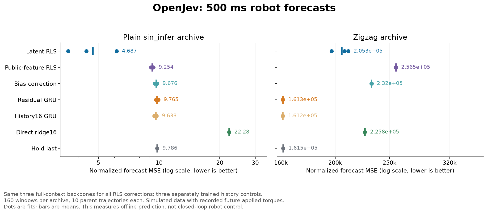
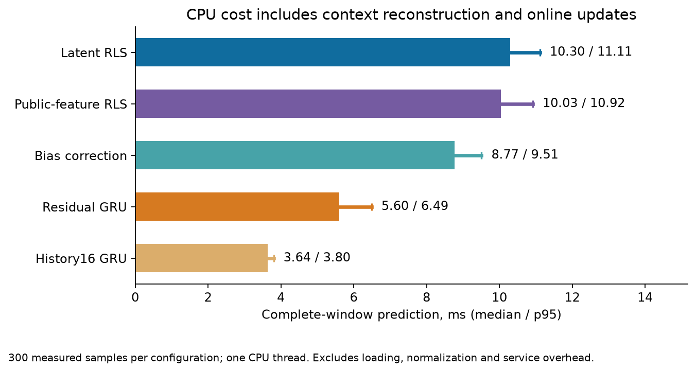

# Residual dynamics: partial gains, failed robustness

September 19, 2026. **Online correction lowered forecast error by 52.0% on
one new archive and increased it by 27.3% on the other.** The fixed continuation
rule failed: **36/49 checks passed**. Most of the first archive's aggregate
improvement came from one trajectory. A post hoc constant-velocity reference
also explains much of the apparent position improvement.

The result does not establish a new architecture advantage. It provides
a recurrent residual baseline and identifies a specific problem with the
current observation scaling. Earlier failed experiments remain unchanged.

## What changed

The earlier action-memory model strongly contracted its state and fit training
data poorly. Its [diagnosis](action-filter-diagnosis.md) motivated a new GRU
that predicts increments from the current observation, starting with exact
persistence. Learned inputs use orientation, observed differences and the full
action block, with an explicit position-offset invariance.

Three full-context GRUs and three separately trained history16 GRUs were fitted.
Each full-context checkpoint was then evaluated with adaptation off, online
bias correction, RLS on public features, and RLS on learned hidden features.
All adaptations use completed real context transitions only. Their weights
and covariance stay fixed throughout each private future forecast. This is
six trained models and fifteen evaluated neural configurations.

We used 500 ms forecasts on two previously unscored official HiP-RSSM archives,
160 windows from ten parent trajectories each. These are simulated robot data,
conditioned on recorded future applied torques. They do not establish issued
command causality, closed-loop control, real-robot effectiveness, or independent
terrain regimes. See the [prospective protocol](residual-dynamics-protocol.md).

## Primary results

Mean normalized observation MSE across all 25 forecast steps and nine channels.
Each neural row averages three paired fits. Lower is better.

| Configuration | Plain archive | Zigzag archive | Median predictor time, ms |
| --- | ---: | ---: | ---: |
| Latent-feature RLS candidate | **4.6874** | 205,291 | 10.298 |
| Public-feature RLS | 9.2544 | 256,526 | 10.035 |
| Bias correction | 9.6759 | 232,045 | 8.770 |
| Residual GRU, no correction | 9.7651 | 161,253 | 5.596 |
| Separately trained history16 GRU | 9.6325 | **161,219** | 3.643 |
| Direct ridge16 | 22.2755 | 225,789 | Not measured separately |
| Hold last observation | 9.7856 | 161,503 | Not measured |

All 13 failed checks concern zigzag: the candidate loses to the uncorrected
GRU, history16 and hold-last on mean error and all three paired fits. Its
9.08% mean gain over direct ridge also misses the required 10% margin. The
1.84 times latency ratio passes the 2 times limit. No subset rescues the gate.

The candidate improves primary error on eight of ten plain-archive parent
trajectories and three of ten zigzag parents. However, plain trajectory 7
accounts for **98.63% of the net aggregate gain**. Excluding it descriptively
reduces the improvement to 6.47%; that exclusion is not a replacement score.
The full data and original scoring rule remain authoritative.

Timing includes state initialization, context reconstruction, every online
update and 25 forecast steps on one Apple M5 Max CPU thread. Each configuration
has 300 measured samples after warmups. Loading, normalization and service work
are excluded. Six fits, 4,140 updates, ridge fitting and the planned evaluations
took 64.76 seconds. Each backbone has 39,369 parameters. Latent RLS adds
19,248 bytes of per-window state to the backbone's 365-byte tensor payload;
equal backbone weights do not mean equal memory or compute.

## Post hoc diagnostics, outside the continuation rule

The cosine of roll has training standard deviation `1.70e-6`, and cosine of
yaw `1.91e-5`. Independent channel standardization heavily weights small
absolute errors in these nearly constant coordinates. Together they account
for **99.96%** of the candidate's zigzag primary error and about 93.51% on the
plain archive. This explains strong metric sensitivity; it does not invalidate
or reverse the frozen outcome.

For context, the following diagnostic restores the position channels to
source units and reports three-dimensional position RMSE in meters:
`sqrt(mean(sum((predicted_xyz - actual_xyz)^2)))`. Neural family scores pool
all fits, windows and forecast steps. This metric was added after inspecting
the primary result and cannot establish a confirmatory success.

| Position RMSE, meters | Plain archive | Zigzag archive |
| --- | ---: | ---: |
| Latent RLS | 0.07337 | 0.15100 |
| Public-feature RLS | 0.08359 | 0.16662 |
| Bias correction | 0.11479 | 0.19973 |
| Residual GRU | 0.29607 | 0.51250 |
| History16 GRU | 0.29349 | 0.50194 |
| Direct ridge16 | 0.25162 | 13.21003 |
| Hold last | 0.58387 | 0.49674 |
| Constant velocity, last16 (post hoc) | 0.08910 | **0.14836** |

The added constant-velocity reference extrapolates the displacement between
context observations 16 and 31, without fitting or selecting a smoothing
window. It generated 320 new analytic forecasts, separately recorded after
the main study. Its normalized MSE is 6.1478 and 242,293.2, worse than latent
RLS on both panels, but its zigzag position error is slightly better. The
position gain over an uncorrected GRU therefore does not isolate a need for
complex learned adaptation. [Full diagnostic and provenance](../output/residual-dynamics-v1/cv-diagnostic-01/report.md).

## Evidence and next research decision

- [Frozen protocol and source/data hashes](../output/residual-dynamics-v1/experiment-01/protocol.json).
- [All training logs](../output/residual-dynamics-v1/experiment-01/training.log),
  [weights and fit receipts](../output/residual-dynamics-v1/experiment-01/run-01),
  and [producer completion](../output/residual-dynamics-v1/experiment-01/run-01/completed.json).
- [Independent saved-output audit](../output/residual-dynamics-v1/report-01/summary.json)
  and [receipt](../output/residual-dynamics-v1/report-01/receipt.json): all 34
  planned prediction rows, 49 criteria, backbone pairing and payload identities
  verified without new model calls.
- [Data provenance](../output/residual-dynamics-v1/data-01/manifest.json),
  [model](../src/openjev/research/residual_dynamics.py), and
  [training runner](../scripts/train_residual_dynamics.py). Raw data and targets
  remain local because the publisher did not supply an explicit dataset license.

The implementation passed 42 focused tests before training. Those tests verify
causality, state ownership and regression arithmetic, not empirical efficacy.

The next useful study should define position and rotation errors in meaningful
units before execution, include constant-motion references, and avoid separately
standardizing redundant near-constant orientation coordinates. Any revised
loss or geometry-aware model needs a new protocol and new confirmation data.
These newly scored archives are now development evidence, not untouched tests.

Online residual regression has close precedents in
[ALPaCA](https://arxiv.org/abs/1807.08912),
[dynamics meta-adaptation](https://arxiv.org/abs/1803.11347), and
[MTS3](https://arxiv.org/abs/2310.18534). Our experiment is not an exact
reproduction of those algorithms, and supplies no connectome, uncertainty
calibration, novel RL, or ICLR-level architectural claim.
