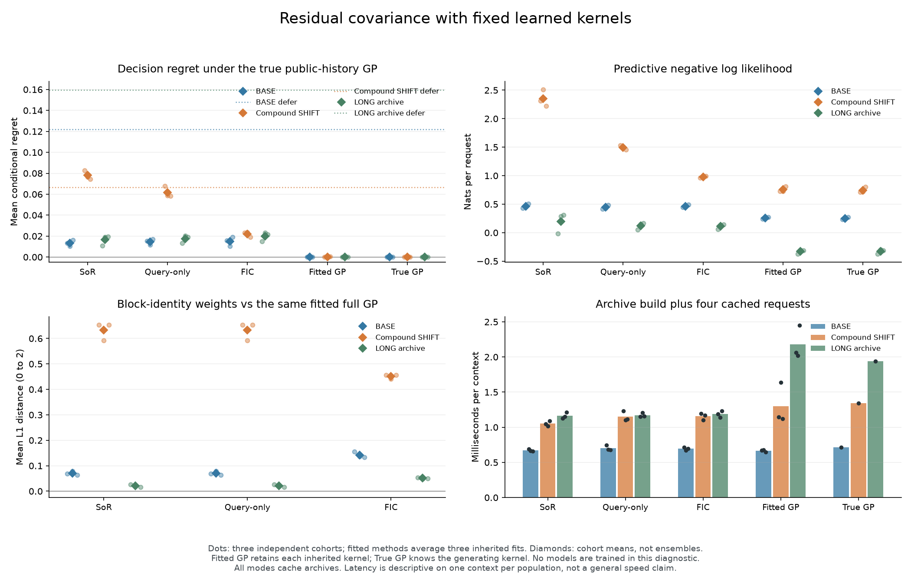

# Residual uncertainty: large SHIFT improvement, failed preservation rule

**The fully independent conditional (FIC) correction reduces SHIFT decision regret by 71.80%, but the registered control does not qualify: 9/11 conditions pass.** Regret rises by 13.64% on BASE and 20.74% on LONG, exceeding both preservation limits. The original query-centered candidate remains failed. This is evidence about an established covariance approximation, not a new learned architecture.

## What changed

Three fixed kernels inherit length and amplitude from every final static-Nyström checkpoint in the [parent study](query-feature-results.md), fit seeds 11, 23 and 37. **No parameters were retrained or selected.** For each kernel, the experiment compares:

- **SoR:** the original rank-16 covariance, with no residual correction.
- **Query only:** identical means and identity weights to SoR, adding missing variance only at the query. This is a deliberately partial diagnostic.
- **FIC:** diagonal residual uncertainty enters archive conditioning, the joint four-example likelihood and query prediction. Residuals are independent per observation event; off-diagonal residual correlations are omitted.
- **Full fitted GP:** full covariance at the same inherited kernel parameters.

The true-kernel GP receives the generating law and marginalizes the unknown function identity from public information. Its zero conditional regret is definitional, not access to a hidden identity or answer. All observations and targets include independent noise of variance 0.0225.

There are **1,152 fresh contexts and 4,608 requests**: three cohorts of 128 contexts in each population, four requests per context. BASE has four function blocks with 16 archived observations each. SHIFT changes both the block count to eight and coordinate extent from [-2,2] to [-3,3]. LONG keeps four blocks and BASE geometry but increases each archive to 128 observations. Requests within a context are correlated; inherited fits share parent TRAIN data. Reported means average scores, not predictions.

## Decisions and predictive quality

Lower is better. Regret is excess expected negative/defer/positive decision cost under the true public-information GP mixture. Wrong sign costs 1; defer costs 0.2. NLL is noisy-target negative log density in nats/request.

| Covariance rule | BASE regret | SHIFT regret | LONG regret | BASE NLL | SHIFT NLL | LONG NLL |
| --- | ---: | ---: | ---: | ---: | ---: | ---: |
| SoR | 0.013252 | 0.077996 | 0.016550 | 0.4629 | 2.3483 | 0.1938 |
| Query only | 0.014663 | 0.061666 | 0.017590 | 0.4449 | 1.4975 | 0.1230 |
| FIC | 0.015060 | 0.021996 | 0.019982 | 0.4653 | 0.9795 | 0.1132 |
| Full fitted GP | 0.000150 | 0.000264 | 0.000012 | 0.2545 | 0.7549 | -0.3292 |
| True-kernel GP | 0.000000 | 0.000000 | 0.000000 | 0.2489 | 0.7458 | -0.3285 |
| Always defer | 0.121825 | 0.066482 | 0.159671 | Not a density model | Not a density model | Not a density model |

The registered rule is unchanged:

| Requirement | Result |
| --- | --- |
| NLL no more than 0.02 nat worse than SoR on each population | 3/3 pass |
| BASE regret <= 1.05 times SoR plus 1e-6 | Fail |
| LONG regret <= 1.05 times SoR plus 1e-6 | Fail |
| SHIFT regret at least 25% lower, NLL at least 0.1 nat lower, and regret below always defer | 3/3 pass |
| SHIFT regret lower on each cohort, averaging the three inherited fits | 3/3 pass |

SHIFT cohort regret falls from 0.082900/0.076493/0.074593 to 0.023134/0.023755/0.019099. FIC nevertheless has higher regret than SoR on every BASE and LONG cohort. Neither the SHIFT gain nor the improved LONG NLL rescues these decision failures.

FIC defers on 65.78% of SHIFT requests, versus 25.09% for SoR and 49.80% for the true GP. Its improvement therefore does not establish calibrated uncertainty. The full fitted GP nearly eliminates conditional regret while keeping the same kernel parameters, showing a substantial approximation gap in this task. That comparison changes the entire covariance treatment and does not isolate one missing correlation as the sole cause.

## Identity inference at the same fitted kernel

Each entry compares an approximation with its own full fitted GP, not with the supplied true kernel. Values are mean identity-weight L1 distance / mean absolute sign-probability error, over all requests and inherited fits.

| Rule | BASE | SHIFT | LONG |
| --- | ---: | ---: | ---: |
| SoR | 0.07056 / 0.05543 | 0.63309 / 0.18529 | 0.02089 / 0.05010 |
| Query only | 0.07056 / 0.06073 | 0.63309 / 0.16406 | 0.02089 / 0.06850 |
| FIC | 0.14211 / 0.07759 | 0.45139 / 0.11031 | 0.05095 / 0.07713 |

The query-only rule preserves identity weights by construction. FIC brings SHIFT weights and sign probabilities closer to full conditioning, but moves both farther away on BASE and LONG. The diagonal correction is not uniformly more faithful. All 81 paired records are retained.

## Cached computation and storage

All methods cache archives, including full GP. One-thread CPU float64 timing covers archive construction plus four sequential requests. Each entry below averages fit-specific medians of 20 repetitions, after three warmups, on the first context of that population. It is descriptive timing on that context, not a general speed or equal-compute claim.

| Rule | BASE ms/context | SHIFT ms/context | LONG ms/context |
| --- | ---: | ---: | ---: |
| SoR | 0.671 | 1.052 | 1.165 |
| Query only | 0.703 | 1.152 | 1.173 |
| FIC | 0.695 | 1.156 | 1.189 |
| Full fitted GP | 0.667 | 1.302 | 2.177 |
| True-kernel GP | 0.718 | 1.346 | 1.941 |

Each low-rank rule retains **11,008 / 19,712 / 11,008 array bytes** on BASE/SHIFT/LONG. Full GP retains **9,728 / 19,456 / 536,576 bytes**. Thus the low-rank cache is not smaller for these short archives, but stays fixed as LONG grows. Raw public input archives occupy a separate 1,536 / 3,072 / 12,288 bytes. Retained arrays exclude Python metadata and transient workspace; these are not peak-memory measurements.

The original run process closed successfully in **23.716 seconds** and the independent audit process in **19.235 seconds**. The producer's inner run timer is 22.576 seconds; it excludes process startup. There were no training updates, retries or parameter changes. Recorded residual roundoff-floor counts are zero.

## Validation, provenance and limits

**61 fabricated tests pass.** The independent audit reconstructs all **117 prediction groups** from dense covariances, checks **59,904 stored query distributions**, reproduces all metric rows and the eleven-condition outcome, and reconciles 39 resource records. It opens 126 NPZ files and loads 648 arrays. It does not invoke the producer's prediction code, regenerate data, run optimizers or deserialize checkpoints. Kernel-scalar extraction is producer/source evidence bound to the three original checkpoint hashes; historical timing and generation order are not replayed.

The [protocol](residual-memory-protocol.md) and [registration](residual-memory-registration.json) were committed in `49d00255` before collection. Registration SHA256: `588c766a41978346b486744fb79a2956adfc818697e880f27240fe8d8258ed6d`. All nine registered sources and snapshots remain unchanged.

- [Audited outcome](residual-memory-results/summary.json), [independent audit](residual-memory-results/audit.json), and [all plotted scalar values](residual-memory-results/plotted-values.json).
- [Current evidence bundle](residual-memory-results/evidence.tar.gz) and [archive index](residual-memory-results/archive-index.json), including data, predictions, sources, closures, parent registration/manifest and three inherited checkpoints.
- **The [parent evidence bundle](query-feature-results/evidence.tar.gz) is also required for full lineage authentication.** It is hash-pinned rather than duplicated wholesale in the new bundle.
- [PNG](residual-memory-results/benchmark.png) and [PDF](residual-memory-results/benchmark.pdf).

[FIC and related sparse GP methods](https://www.jmlr.org/papers/v6/quinonero-candela05a.html) are established prior art. These results support testing how approximation affects uncertain decisions; they do not qualify FIC as a universally better control, rescue query centering, or demonstrate learned recurrent retention. The [prospective correlation-retention note](residual-memory-next.md) is a separate, conditional proposal with analytic controls, not an admitted experiment or an architecture claim.
