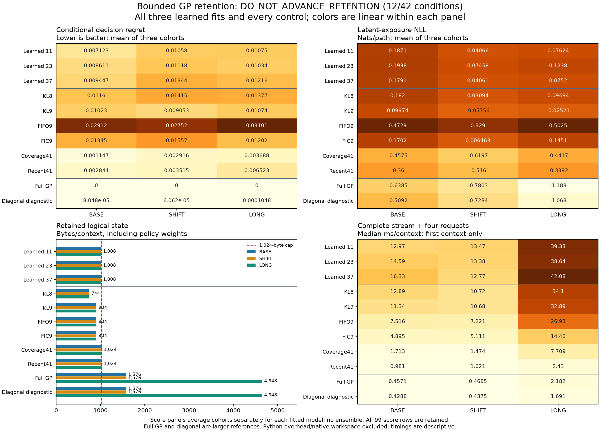

# Learned Gaussian memory retention: 12/42 conditions pass

**The registered outcome is `DO_NOT_ADVANCE_RETENTION`.** Learning improves mean decision regret over the same eight-slot KL deletion rule by **27.63% on BASE, 17.07% on SHIFT and 19.53% on LONG**. Those gains do not survive the stronger storage-matched controls. The learned mean has **7.32, 4.02 and 3.00 times** the regret of coverage-based retention of 41 raw observations, respectively. The raw-observation controls are also faster in the recorded inference probe.

This experiment trains a deletion policy for a **known, static Gaussian field**. It does not learn the field's kernel, observation noise or world transitions. Each real observation is assimilated once into an expanded Gaussian posterior. Deletion retains a posterior marginal and restores the supplied prior conditional outside the dictionary. The learned policy adds 33 parameters to a minimum-KL deletion score. Future requests are unavailable during evaluation writes; TRAIN request rewards supervise the policy.

All three final fits are retained. They share 256 TRAIN fields, each with 64 observations and four requests. Each fit completes 512 updates and 16,384 sampled group trajectories: **1,536 updates and 49,152 trajectories total**, not that many independent fields. Fresh evaluation contains **1,152 contexts, 4,608 requests and 18,432 path outcomes**, across three cohorts per population. BASE has 64 observations and axial paths. SHIFT changes paths to diagonal geometry, including greater geometric length. LONG has 192 observations and axial paths. Requests and outcomes within a field are correlated.

Each request chooses among four paths or deferral. A path costs `0.02 + P(mean latent exposure > 0.5)`; deferral costs 0.20. Regret uses the full public-history GP's conditional expected costs, not realized private outcomes. NLL scores realized latent path exposure in nats/path, without future observation noise. Lower is better. Entries below average the three evaluation cohorts; the learned mean averages scores from the three fits, not their predictions.

| Method | BASE regret | SHIFT regret | LONG regret | BASE NLL | SHIFT NLL | LONG NLL |
| --- | ---: | ---: | ---: | ---: | ---: | ---: |
| Learned, seed 11 | 0.007123 | 0.010581 | 0.010752 | 0.1871 | 0.0407 | 0.0762 |
| Learned, seed 23 | 0.008611 | 0.011184 | 0.010337 | 0.1938 | 0.0746 | 0.1238 |
| Learned, seed 37 | 0.009447 | 0.013439 | 0.012157 | 0.1791 | 0.0406 | 0.0752 |
| **Learned mean** | **0.008394** | **0.011735** | **0.011082** | **0.1866** | **0.0519** | **0.0917** |
| KL8 | 0.011598 | 0.014150 | 0.013771 | 0.1820 | 0.0309 | 0.0948 |
| KL9 | 0.010228 | 0.009053 | 0.010741 | 0.0997 | -0.0576 | -0.0252 |
| FIFO9 | 0.029122 | 0.027521 | 0.031007 | 0.4729 | 0.3290 | 0.5025 |
| FIC9 | 0.013450 | 0.015570 | 0.012021 | 0.1702 | 0.0065 | 0.1451 |
| Coverage41 | 0.001147 | 0.002916 | 0.003688 | -0.4575 | -0.6197 | -0.4417 |
| Recent41 | 0.002844 | 0.003515 | 0.006523 | -0.3600 | -0.5160 | -0.3392 |
| Full-history GP | 0.000000 | 0.000000 | 0.000000 | -0.6385 | -0.7803 | -1.1881 |
| Full-history GP, diagonalized covariance | 0.000080 | 0.000061 | 0.000105 | -0.5092 | -0.7284 | -1.0684 |

Buying one extra useful posterior slot, KL9, changes the conclusion: learned mean regret is 17.93% lower on BASE, but **29.62% higher on SHIFT and 3.18% higher on LONG**. Both 41-observation controls outperform every learned fit in the population means. Exact retained-row conditioning refers only to their retained observations, not the discarded history. Full-history zero regret is definitional; both full-history references exceed the storage cap.

| Registered requirement | Passed |
| --- | ---: |
| Mean regret versus each budgeted control: 10% improvement on BASE/LONG, 5% noninferiority on SHIFT | 9/18 |
| Mean NLL within 0.02 nat of the strongest budgeted control | 0/3 |
| Mean regret below always defer | 3/3 |
| Every cohort satisfies strongest-control noninferiority | 0/9 |
| Every fit satisfies strongest-control noninferiority | 0/9 |
| **Total** | **12/42** |

The learned policies' nominal 90% intervals cover **98.39%, 98.27% and 98.79%** of BASE, SHIFT and LONG outcomes. Raw-observation controls are around 90%. This is overcoverage, not evidence of calibrated uncertainty. The diagonalized full-history diagnostic has much worse coverage, about 77-82%, but regret remains only 0.000061-0.000105. Thus a large predictive-calibration difference need not produce a comparable decision loss here. That diagnostic alone does not explain the learned policies' much larger error or isolate its cause.

The logical cap counts retained arrays, four kernel/noise scalars, an event counter and all learned weights. Eight posterior slots cost 744 bytes; the learned policy adds 264 bytes, totaling **1,008 bytes**. Raw coordinate/label storage buys 41 observations within 1,024 bytes. This comparison gives the analytic controls useful capacity rather than unused padding.

| Method | Logical bytes/context | BASE ms/context | SHIFT ms/context | LONG ms/context |
| --- | ---: | ---: | ---: | ---: |
| Learned, seed 11 | 1,008 | 12.965 | 13.469 | 39.331 |
| Learned, seed 23 | 1,008 | 14.591 | 13.383 | 38.640 |
| Learned, seed 37 | 1,008 | 16.333 | 12.771 | 42.079 |
| KL8 | 744 | 12.891 | 10.719 | 34.102 |
| KL9 | 904 | 11.337 | 10.681 | 32.893 |
| FIFO9 | 904 | 7.516 | 7.221 | 26.934 |
| FIC9 | 904 | 4.895 | 5.111 | 14.459 |
| Coverage41 | 1,024 | 1.713 | 1.474 | 7.709 |
| Recent41 | 1,024 | 0.981 | 1.021 | 2.430 |
| Full-history GP | 1,576 / 1,576 / 4,648 | 0.457 | 0.468 | 2.182 |
| Full-history GP, diagonalized covariance | 1,576 / 1,576 / 4,648 | 0.429 | 0.437 | 1.691 |

Times are saved medians of ten repetitions after three warmups, using the first context of each population and processing its complete stream plus four requests on one CPU thread. They include retention and matrix reconstruction. They are not population timing estimates or a general speed claim. Logical bytes exclude Python objects and temporary workspace; native allocations and peak RSS were not measured. Inference retained no parameter-gradient tensors.

The three fits took **33.029, 33.434 and 33.244 seconds**. The original run process closed successfully in **134.270 seconds**, including generation, all training, evaluation and timing; its inner timer was 132.992 seconds. The independent audit process closed successfully in **10.734 seconds**. No fit was replaced, retried or selected after evaluation.

**151 fabricated tests passed.** The independent audit reconstructs all 99 prediction groups, replays 54 projected evaluation batches, reconstructs 18 raw-retention and nine FIC state batches, and verifies all 42 conditions and 33 resource records. Each state batch contains 128 contexts. It performs **567,168 deletion-priority checks with zero tolerance-level near ties**, decoding 200 NPZ files and 843 arrays. It does not invoke producer models, regenerate fields, deserialize optimizers or replay training updates. Timing, historical training execution and roundoff-floor counts remain source/receipt evidence; private realized exposures are scored as saved.

The [protocol](retention-protocol.md), [registration](retention-registration.json) and 13 sources were committed in `19f99145` before collection. Registration SHA256: `3319b2d1a04b43d8e14c5d48bc2f41177d75e17acee02704d2a732e72a251f5b`.

- [Audited outcome](retention-results/summary.json), [independent audit](retention-results/audit.json), and [full plotted scalar values](retention-results/plotted-values.json).
- [Evidence archive](retention-results/evidence.tar.gz) and [archive index](retention-results/archive-index.json), including the current data, predictions, states, traces, source snapshots, original process records and prior-result summary. No parent weights or datasets were reused; current scientific evidence is self-contained.
- [PNG](retention-results/benchmark.png) and [PDF](retention-results/benchmark.pdf).

[Sparse online GPs](https://eprints.soton.ac.uk/259182/), [streaming GP approximations](https://arxiv.org/abs/1705.07131) and [decision-directed belief compression](https://papers.nips.cc/paper_files/paper/2002/hash/14ea0d5b0cf49525d1866cb1e95ada5d-Abstract.html) are established prior art. The trained selector uses group-relative on-policy REINFORCE, not a new GP or GRPO algorithm. This pilot shows a gain over KL8 inside one supplied-law recurrence, but fails the registered comparative requirements. It does not support a novel architecture, biological-memory claim or calibrated decision service. The branch does not advance under this protocol.
