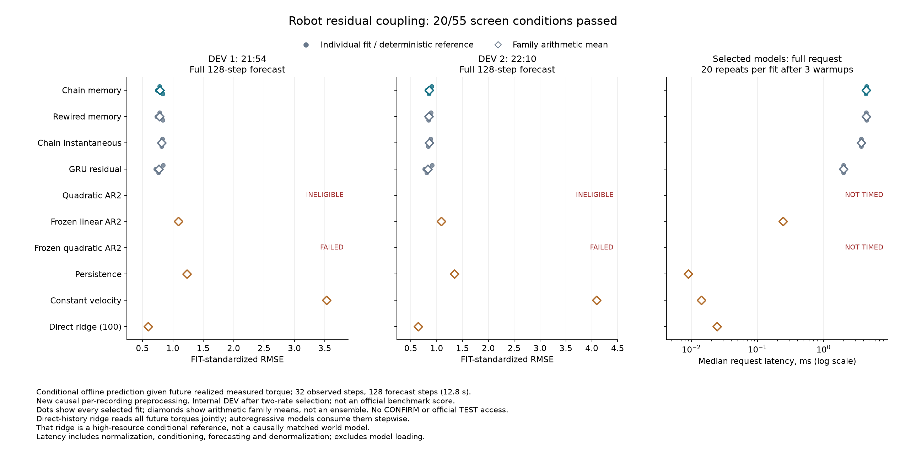

# Joint-chain memory trails conventional and rewired controls

**The candidate does not advance: 20/55 registered conditions pass.** Of 30
scheduled training attempts, 24 complete and six polynomial fits fail with
nonfinite rollout losses. The physical-chain residual does not outperform its
rewired control or the GRU. Its smaller parameter count also does not produce
a measured inference-speed advantage in this implementation.

Full 128-step standardized RMSE, lower is better:

| Model | Parameters | DEV A | DEV B |
| --- | ---: | ---: | ---: |
| Chain memory, candidate | 266 | 0.78402 | 0.85290 |
| Rewired memory | 266 | 0.78114 | 0.84783 |
| Chain instantaneous | 266 | 0.81369 | 0.85314 |
| GRU residual | 1,296 | 0.77177 | 0.82614 |
| Refined quadratic AR2 | 1,950 | Ineligible | Ineligible |
| Frozen linear AR2 | 150 | 1.08777 | 1.08615 |
| Frozen quadratic AR2 | 1,950 | Nonfinite | Nonfinite |
| Last position | 0 | 1.23294 | 1.34667 |
| Constant velocity | 0 | 3.53034 | 4.09268 |
| Large direct-history ridge | 738,048 | 0.59512 | 0.64189 |

Trained rows are arithmetic means of three individual fits at each family's
selected learning rate, not ensemble predictions. Rate selection uses pooled
DEV squared error across both files and all seeds. The
[complete table](robot-coupling-results/table.md) and
[all-candidate CSV](robot-coupling-results/all-candidates.csv) retain both rates,
both horizons, each seed and the failures. DEV A/B are recordings 21H_54M and
22H_10M from 15 December 2021.

The candidate reduces error **3.65% / 0.03%** against instantaneous messages,
below the required 10% on both files. It has **0.37% / 0.60% higher error than
rewired memory**, and **1.59% / 3.24% higher error than GRU**. Thus the outcome
does not depend solely on the failed polynomial comparator. That comparator's
failure independently prevents advancement and is a limitation of this recipe,
not evidence that polynomial models generally cannot solve the task.

The large direct-history reference has the lowest error among these models.
It accesses the entire future measured-torque sequence jointly, whereas the
autoregressive predictors consume torques step by step. It is a high-resource
conditional reference, **not a causally matched world model**. Its result does
not establish an issued-command controller or a deployable robot policy.

On an Apple M5 Max CPU, the median of the three selected fits' median complete
request latencies is **4.42 ms for chain memory versus 1.99 ms for GRU**.
Each request includes normalization, 32 observed steps, a 128-step forecast and
inverse normalization; disk/model loading is excluded. Both models retain 28
recurrent float32 values. Logical persistent storage is 1,528 bytes for the
candidate and 5,488 for GRU, including weights, graph buffers where applicable,
and normalizers. Temporary runtime workspace is unmeasured; request inputs and
outputs are charged separately in the cost table. These CPU implementation
measurements are not an architecture-intrinsic speed bound or a Rust comparison.

The source is the [Industrial Robot identification dataset](https://doi.org/10.26204/data/5).
Seven complete recordings supply FIT data, two supply DEV, two internal
confirmation recordings remain closed, and official TEST remains closed.
Repeated trajectories stay in their original recording. Filtering is causal
and recording-local, unlike the official prepared-data pipeline. Each DEV file
has 22 nonoverlapping context-plus-forecast windows. Every scored forecast uses
only observed context and input torques, with no future-position feedback.
All fits finish before numerical DEV loading. These scores are not directly
comparable with the published benchmark or a scenario-shift test.

The run completes 24,584 optimizer updates, including eight before the failed
polynomial attempts stop. It takes 192.36 seconds internally and 193.65 seconds
including process startup. The [98-test qualification](robot-coupling-results/engineering/qualification-01-1.txt)
includes independent cell equations, GRU arithmetic, window alignment, source
guards, failed-run handling and a fabricated complete campaign. Saved evidence
preserves 60 initial/final checkpoints, 30 optimizer states and 30 loss traces.

The evidence audit verifies 270 original payloads and 1,095 arrays, independently
recomputes all 144 metric rows and 55 conditions, and exactly replays the 48
successful checkpoint forecasts through the qualified model implementation.
It does not replay training updates or independently implement the entire
recurrence. The first audit attempt exposed a checker copy that changed array
memory layout. A one-line layout-preserving repair, with a fabricated regression
check, restored exact replay without changing saved predictions or equality
criteria. Both audit attempts and the [repair evidence](robot-coupling-results/audit-repair/layout-repair-01.json)
are retained. The corrected audit takes 1.61 seconds internally.

The seven scientific sources and
[registration](robot-coupling-registration.json) were committed at
`bf499540b1c98f55213c67ec4d65cf56fe6a6411` before measurement decoding.
Registration SHA256:
`7bf116569bc141bf949b04b5bd79d465b2cd0acda098ffcf63cc26553725c4de`.

[Protocol](robot-coupling-protocol.md) ·
[Evidence audit](robot-coupling-results/audit.json) ·
[All model artifacts](robot-coupling-results/study) ·
[Public manifest](robot-coupling-results/manifest.json) ·
[PDF chart](robot-coupling-results/benchmark.pdf) ·
[Next research constraint](robot-coupling-next.md).

The graph is a mechanical structural prior, not a biological connectome, and
the comparison uses one fixed degree-matched rewire rather than a population
of randomly sampled graphs.
Recurrent graphs and edge memory already have substantial prior art. This
experiment establishes neither a new architecture nor an ICLR-ready result.
