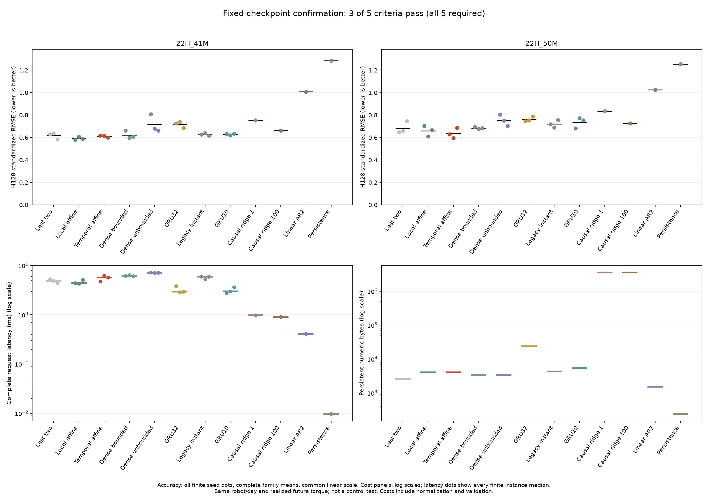

# History initialization does not pass reserved-recording confirmation

**The fixed temporal-affine recipe fails confirmation: 3 of 5 criteria pass.** Its mean H128 forecast error is 4.16% below last-two initialization but only 0.38% below the equally sized local initializer. Both comparisons require at least 5%. On the first recording it is 3.19% worse than the better local control, exceeding the 2% allowance. The independent audit agrees with the original result.

[Scores and criteria](robot-history-confirmation-results/table.md) · [Complete public evidence inventory](robot-history-confirmation-results/manifest.json) · [Prospective protocol](robot-history-confirmation-protocol.md) · [Frozen registration](robot-history-confirmation-registration.json) · [Earlier development result](robot-history-initialization-results.md).

## What was tested

The earlier development study passed all five criteria, including a 5.21% improvement over local affine. Before decoding either reserved recording, this continuation fixed the 24 previously trained checkpoints, their development-selected learning rates, FIT-only normalizers, four deterministic references, windows, costs and decision rule. There was no new fitting, calibration, recipe selection, seed selection or ensemble.

The primary models share the same 590-parameter recurrent dense transition. Last-two initializes from the final two observed positions. Local affine adds a 372-parameter correction using recent position, difference, torque and local nonlinear features. Temporal affine uses the same parameter count but replaces the nonlinear local features with older-position slope and older-torque mean. This tests the complete trained feature recipe, rather than every possible memory mechanism.

Each recording supplies 22 fixed windows. Each request observes 32 samples and forecasts 128 samples, or 12.8 seconds, using realized future measured torques. All models reset between requests and receive no later observed positions during forecasting. Processing uses the unchanged causal low-pass filter and inherited FIT normalization. This is conditional forecasting, not command-driven robot control.

## Results and costs

| Model | CONFIRM1 RMSE | CONFIRM2 RMSE | Equal-file RMSE | Request ms | Persistent numeric bytes |
|---|---:|---:|---:|---:|---:|
| Temporal affine | 0.61074 | **0.63705** | **0.62389** | 5.673 | 4,088 |
| Local affine | **0.59188** | 0.66071 | 0.62629 | 4.406 | 4,088 |
| Last-two | 0.61719 | 0.68476 | 0.65098 | 4.890 | 2,600 |
| Bounded dense | 0.62258 | 0.68483 | 0.65370 | 6.204 | 3,464 |
| Unbounded dense | 0.71615 | 0.75390 | 0.73502 | 7.160 | 3,464 |
| Legacy instant scheduler | 0.62813 | 0.72125 | 0.67469 | 5.900 | 4,296 |
| GRU10 residual | 0.62944 | 0.73638 | 0.68291 | 2.997 | 5,488 |
| GRU32 residual | 0.71693 | 0.76193 | 0.73943 | 2.931 | 24,056 |
| Causal ridge, penalty 1 | 0.75300 | 0.83522 | 0.79411 | 0.986 | 3,565,264 |
| Causal ridge, penalty 100 | 0.66104 | 0.72572 | 0.69338 | 0.912 | 3,565,264 |
| Frozen linear AR2 | 1.00941 | 1.02530 | 1.01735 | 0.413 | 1,536 |
| Persistence | 1.28446 | 1.25636 | 1.27041 | 0.010 | 240 |

Errors are standardized using FIT-only scales; lower is better. Each neural file value averages three individual seed RMSEs. The final value weights the two files equally. CONFIRM1 is `recording_2021_12_15_22H_41M.mat`; CONFIRM2 is `recording_2021_12_15_22H_50M.mat`. Both come from the same robot and day. Forty-four windows and three initialization seeds do not constitute independent robots or dataset replications. H64 and per-joint physical errors remain in the evidence.

| Registered criterion | Result |
|---|---|
| Complete finite primary recipes | Pass |
| At least 5% mean improvement against both local controls | **Fail: 4.16% and 0.38%** |
| Neither recording more than 2% worse than its better local control | **Fail: first recording 3.19% worse** |
| Complete-request latency at most 1.25 times last-two | Pass: 1.1601 times |
| Complete comparison set, no control dominates error, latency and storage | Pass |

Temporal affine has the lowest mean error among the declared models, but the margin over the equally sized local model is small and uneven. It beats local affine in only two of the six paired seed/recording comparisons, losing all three on the first recording. These descriptive counts are not a significance test. Passing the cost and completeness criteria cannot replace the two failed quality criteria.

All 28 instances receive three warmups and twenty full-request timing repetitions on the shared Apple M5 Max host with one CPU thread. Costs include normalization, casting, context processing, transition preparation, all 128 forecast steps, denormalization, validation and the common deadline callback. Temporal takes 16.01% longer than last-two and 28.76% longer than local affine in this run. These shared-host timings are not isolated hardware measurements or a speedup against the earlier development run.

Persistent numeric bytes include parameters, buffers, explicit recurrent state and normalization. They exclude request arrays, temporary workspace, Python objects and model loading. Historical training costs and all selected checkpoints are retained; this confirmation adds zero optimizer updates.

## Evidence and limits

The protocol was committed as `a3343f69`; all 36 qualified sources, launcher and exact registration were committed as `4852d9844f4955a4121fff3fdd2739456d82f7ed` before numerical access. The registration SHA256 is `a710a6faf77cdb19e0f79354ea46f8aecda7aba01950f22b90be7af1cfff7d53`.

The first synthetic qualification retained 161 passing checks and two failed exact-tie fixtures. Replacing the fixture value 0.8 with exactly representable 0.75 removed aggregation roundoff; no production calculation, criterion or threshold changed. The second qualification passed all 163 tests and lint. Both original attempts, logs and source snapshots are preserved.

The single original evaluation completed in 6.64 seconds. All 56 forecast attempts, 112 metric rows and 28 timing attempts completed without numerical failures. Before/after parameter hashes agree for all 24 models. The independent audit completed on its first invocation in 4.92 seconds. It independently reconstructed both raw preprocessing paths, all windows, eight deterministic forecasts, scores and five criteria, and replayed 48 neural forecasts using the qualified model implementation. It checked 560 saved timing samples without timing again. It did not independently reimplement neural recurrences or replay historical optimization.

The publication helper passes 39 fabricated checks and publishes from saved audited outputs only, with zero model calls, rescoring or timing. The package contains **329 files**, including its manifest and receipt. [Publication and visual verification](robot-history-confirmation-publication-records/verification.json) retains the original packaging process and complete byte checks.

The public evidence excludes the two processed measurement arrays and two measured target-window files, retaining their exact descriptors. Raw measurements remain external under the [dataset's terms](https://doi.org/10.26204/data/5). Forecasts, checkpoints, metrics, timings, source snapshots, qualification attempts and original execution records are preserved for inspection.

**The confirmation claim is rejected under the registered rule.** The development result remains a valid development observation, but it does not establish a robust benefit from this temporal initializer. Neither result establishes biological wiring, calibrated uncertainty, a new recurrent architecture or control performance.

These two recordings are now exposed and cannot be reused as fresh confirmation after tuning. Official TEST `22H_58M` remains unopened. Any revised model needs a separately declared development comparison and new unexposed evidence. The [next proposed comparison](robot-history-confirmation-next.md) isolates causal state correction with the learned transition frozen. It has not been implemented or evaluated. Adding connectome structure or an RL objective alone would not answer that question.
