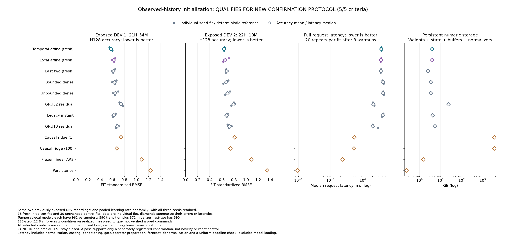

# Observed history improves initialization on development recordings

**The temporal initializer passes all five predeclared criteria.** It lowers average H128 forecast error by **6.48% versus the original last-two initializer** and **5.21% versus an equally sized local initializer**, with **4.18% more request latency** than last-two. The independent audit agrees. This qualifies a separately registered confirmation experiment; it does not establish a novel architecture.

[All scores and five criteria](robot-history-initialization-results/table.md) · [All checkpoints and evidence](robot-history-initialization-results/manifest.json) · [Independent audit](robot-history-initialization-results/audit.json) · [Protocol](robot-history-initialization-protocol.md) · [Registration](robot-history-initialization-registration.json).

## What changed

All three fresh arms use the same 590-parameter recurrent dense transition, twelve-value state, paired batches and training budget. Last-two initializes from the final two observed positions. Local affine adds a 372-parameter correction based on recent position, difference and torque, including local nonlinear features. Temporal affine replaces those nonlinear features with an older-position slope and older-torque mean. Both affine models have 962 parameters and begin with zero corrections; they can modify all twelve initial state coordinates after training.

Eighteen fresh fits cover three seeds and two learning rates, each with 4,096 Adam updates. Thirty unchanged parent fits supply GRU10, GRU32, legacy scheduler and dense controls. Four deterministic references remain visible, including both ridge penalties. The study retains every fit and both rates, selects one rate per family using pooled H128 SSE on exposed DEV, and never selects a best seed or ensembles forecasts. Both affine arms select .003; last-two selects .001. The complete rate choices appear in the linked table.

Each request observes 32 samples and forecasts 128 samples, or 12.8 seconds. Future inputs are realized measured torques. This is conditional forecasting on recorded robot data, not verified command-driven control.

## Results and costs

| Model | Parameters | DEV1 RMSE | DEV2 RMSE | Mean RMSE | Request ms | Persistent numeric bytes |
|---|---:|---:|---:|---:|---:|---:|
| Temporal affine, fresh | 962 | **0.57681** | **0.63598** | **0.60639** | 3.751 | 4,088 |
| Local affine, fresh | 962 | 0.62212 | 0.65733 | 0.63972 | 3.633 | 4,088 |
| Last-two, fresh | 590 | 0.61832 | 0.67847 | 0.64839 | 3.600 | 2,600 |
| Bounded dense | 806 | 0.63677 | 0.67244 | 0.65460 | 4.277 | 3,464 |
| Unbounded dense | 806 | 0.64967 | 0.69214 | 0.67091 | 4.280 | 3,464 |
| Legacy instant scheduler | 1,014 | 0.62582 | 0.67959 | 0.65271 | 4.178 | 4,296 |
| GRU10 residual | 1,296 | 0.68225 | 0.72576 | 0.70400 | 2.037 | 5,488 |
| GRU32 residual | 5,916 | 0.74267 | 0.79181 | 0.76724 | 2.131 | 24,056 |
| Causal ridge, penalty 1 | 445,440 | 0.74422 | 0.81135 | 0.77779 | 0.541 | 3,565,264 |
| Causal ridge, penalty 100 | 445,440 | 0.67545 | 0.74077 | 0.70811 | 0.528 | 3,565,264 |
| Frozen linear AR2 | 150 | 1.08777 | 1.08615 | 1.08696 | 0.235 | 1,536 |
| Persistence | 0 | 1.23294 | 1.34667 | 1.28980 | 0.009 | 240 |

Lower error is better. Errors use FIT-only standardization; neural file values average the three individual fit RMSEs, and the final mean weights both files equally. DEV1 is `21H_54M`, DEV2 is `22H_10M`, recorded on the same robot on 2021-12-15. Both recordings have repeatedly informed development. Per-joint errors in degrees, H64 scores, every seed and both learning rates remain in the evidence.

All five criteria pass: complete primary recipes, at least 5% average improvement over both locals, no file more than 2% worse than its better local control, latency within 1.25 times last-two, and no declared control dominating error, latency and storage. The gain over local affine clears the 5% threshold by only **0.21 percentage points**. All six seed/file comparisons favor temporal over last-two; five of six favor it over local affine. The second-file seed 8103 comparison is worse by 0.01616 standardized RMSE.

Temporal has the lowest mean error among the declared controls, but GRUs and ridge run faster. Its storage is 57.23% greater than last-two and equal to local affine. Current timings include normalization, conversion, conditioning, transition preparation, all forecast steps, denormalization and finite/deadline checks. Each selected fit receives three warmups and twenty repetitions on the shared Apple M5 Max host with one CPU thread. Family latency is the median of the three fit medians. Persistent bytes include parameters, buffers, state and normalizers; request arrays, temporary workspace, Python objects and model loading are excluded. Cached training times remain historical.

## What the history diagnostic establishes

Reversing the older thirty position/torque pairs while retaining the last two leaves all twelve local forecasts exactly unchanged. All six temporal forecasts change and five worsen. Temporal mean error rises 1.48% to 0.61537, still below both local controls. All eighteen diagnostic attempts remain finite.

This supports sensitivity to older order, but the mean-torque feature survives reversal and the corruption is outside the ordinary data distribution. It does not isolate all useful history information or identify a physical mechanism. A learned transition and its initializer are jointly fitted. The feature families also differ, so this is evidence for the complete temporal-feature recipe, not a proof that any memory mechanism would help. History could encode causal-filter state, unobserved physical state or a statistical regularity.

History encoders for nonlinear state models have established [prior art](https://proceedings.mlr.press/v144/beintema21a.html). The result supplies a stronger baseline for further recurrent work. It is not evidence for connectome wiring, calibrated uncertainty, proprietary RLCD or a new learning algorithm.

## Reproducibility and continuation

The pre-fit commit is `80fc2369b60d8b8434832af904a1f50c099f8031`. The original process completes in 1,279.62 seconds with 73,728 fresh optimizer updates. All thirty inherited fits and their 122,880 historical updates remain unchanged. No fit, ordinary score or diagnostic fails; no attempt restarts or deadline expires.

The pre-run qualification passes 145 fabricated checks. The independent auditor passes 105 checks and the publication helpers pass 87. Their original receipts, logs and source snapshots are retained, including both publication qualifications before and after readability corrections; those two runs are not additive test counts. The actual audit passes on its first invocation, verifies 96 neural and eight reference forecasts, eighteen diagnostic replays, 208 ordinary and 36 diagnostic score rows, rate selection and all five criteria. It independently computes scores and reference forecasts but reuses qualified model inference, so it is not an independent recurrence implementation or a replay of optimization.

The public package contains **593 files**, including its manifest: all initial/final checkpoints, Adam states, traces, batches, derived forecasts, source snapshots, qualifications and original execution records. Exactly two measured DEV target-window files remain local under published hashes. Raw measurements and eleven inherited input payloads remain external under the [dataset's own terms](https://doi.org/10.26204/data/5).

**CONFIRM and official TEST remain unopened.** The next step is to register a fixed-checkpoint confirmation comparison before reading the reserved recordings, with these selected recipes and the complete controls. No further DEV search is needed to justify that step. A positive confirmation would still need an independent environment and stronger mechanistic evidence before an ICLR novelty claim. The earlier [reflection-capacity failure](robot-reflection-capacity-results.md) and [Rust parity failure](robot-native-results.md) remain unchanged.
