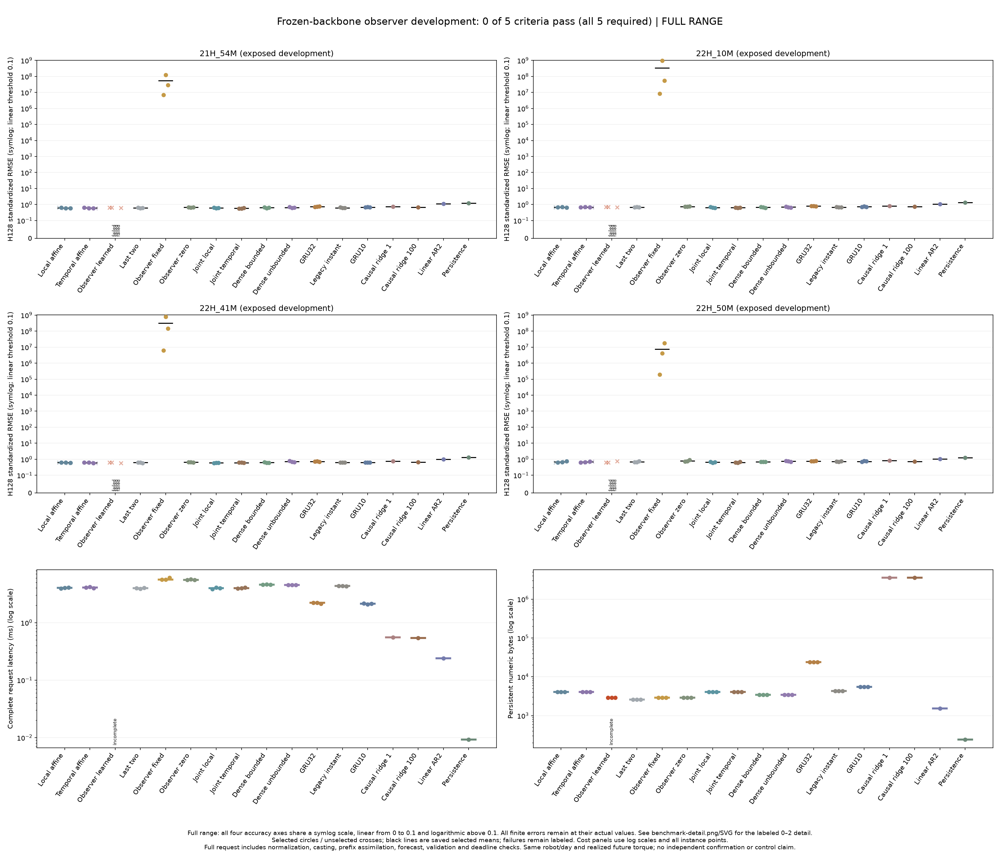

# Frozen-dynamics observer: development failure

**The learned observer fails the registered continuation rule: 0/5 criteria pass.** Three of its six fits stopped with a nonfinite training gradient norm. Neither learning rate completed all three seeds, so the primary model has no eligible aggregate accuracy or latency result. The independent audit agrees with the complete saved outcome.

This is a failed development experiment, not an independent confirmation or evidence for a new architecture. All four robot recordings were already exposed. The [earlier reserved-recording failure](robot-history-confirmation-results.md) remains unchanged.

[Readable detail view](robot-observer-results/benchmark-detail.png) · [All 416 scores](robot-observer-results/scores.csv) · [All 43 cost slots](robot-observer-results/costs.csv) · [Complete table](robot-observer-results/table.md) · [Protocol](robot-observer-protocol.md) · [Evidence and checkpoints](robot-observer-results/README.md).

## What was tested

Each seed reused its exact trained 590-parameter transition. Those parameters stayed frozen. New local and temporal affine initializers trained 372 parameters each; the learned observer trained a 12-by-6 gain with 72 parameters. The observer predicted and corrected state through 30 observed prefix steps, then forecast 128 steps without future position observations.

The comparison retained 17 families: three newly trained initializers, three fixed controls, seven previously selected neural families and four deterministic references. All 18 new fits used the original paired training batches, two rates and three seeds. Rates could use only the original two DEV recordings. The two former confirmation recordings could not select rates.

## Complete training outcome

All 12 affine fits completed 4,096 updates. The learned observer outcomes were:

| Seed | Rate | Completed updates | Outcome |
|---|---:|---:|---|
| 8101 | 0.001 | 4,096 | Complete |
| 8101 | 0.003 | 4,096 | Complete |
| 8102 | 0.001 | 0 | Nonfinite training gradient norm |
| 8102 | 0.003 | 0 | Nonfinite training gradient norm |
| 8103 | 0.001 | 22 | Nonfinite training gradient norm |
| 8103 | 0.003 | 4,096 | Complete |

The study retained 61,462 of 73,728 scheduled updates, including the partial failed fit. All attempts, initial/final checkpoints, optimizer arrays and completed traces remain available. New fitting took 856.16 seconds including per-fit construction and preservation; the complete original process took 866.71 seconds. These exclude the inherited backbone's historical training cost.

There were 208 scheduled forecast attempts and 416 H64/H128 score rows. Twelve forecast attempts were unavailable because their training failed, producing 24 failed score rows. All 43 planned selected cost slots remain present, including three explicitly unavailable learned-observer slots.

## Accuracy and cost

These are equal-four-file means of the three individual seed H128 RMSEs. The table shows selected controls; the complete linked table retains every family. Request time includes normalization, casts, the entire prefix and forecast, validation and deadline checks.

| Family | Standardized RMSE | Request ms | Persistent numeric bytes |
|---|---:|---:|---:|
| Learned observer | Unavailable | Unavailable | 2,888 per attempted model |
| Historical jointly trained temporal initializer | 0.615141 | 3.988 | 4,088 |
| Historical jointly trained local initializer | 0.633010 | 3.992 | 4,088 |
| New temporal initializer, frozen dynamics | 0.641713 | 4.061 | 4,088 |
| New local initializer, frozen dynamics | 0.643459 | 4.006 | 4,088 |
| Frozen last-two initializer | 0.649685 | 3.964 | 2,600 |
| Zero-gain observer | 0.714894 | 5.522 | 2,888 |
| Fixed identity-gain observer | 179,802,896.40 | 5.614 | 2,888 |

The fixed-gain observer's extremely large finite errors are retained in the full-range figure. Its output is not repaired or clipped. The detail figure marks values outside its displayed range. Neither newly fitted affine initializer beats the strongest historical control. That control's current exposed-data average does not reverse its earlier failed confirmation.

All five continuation checks fail closed because no learned-observer rate has complete seed coverage. This is not five independently measured disadvantages: its aggregate gain, per-file harm, latency ratio and complete frontier cannot be established. Failed or unavailable timing is never recorded as zero.

## What the failure establishes

The guard fires after a finite loss and backpropagation, at gradient-norm clipping, before an optimizer update. A nonfinite aggregate norm can arise from nonfinite gradient entries or overflow while accumulating large finite float32 entries. The preserved evidence does not distinguish those causes. At seed 8102, both rates fail before their first update, so those failures cannot be attributed to the learning rate.

There is a concrete mechanism to investigate. With position selector `H` and correction gain `K`, the prefix update is `z = f(z_prev, u) + K(q - H f(z_prev, u))`. Its state Jacobian is `(I - K H) J_f`. A bound on the frozen transition does not automatically bound the corrected map or its state-dependent gate derivatives. Initializing `K = [I; I]` injects the observed position error into both position coordinates and unverified latent coordinates. This is a source-based hypothesis, not a diagnosis established by this run.

The next minimal test is matched learned and fixed `K = [I; 0]` initialization, keeping the dynamics, trainable parameter count, batches, loss, rates and controls fixed. A new protocol should capture gradient-entry finiteness, maximum magnitude and a float64 norm **before** clipping, plus prefix state and innovation norms. Any altered numerical rule must be declared prospectively. The [second-environment proposal](robot-observer-transfer-plan.md) remains conditional on a complete successful development recipe.

## Audit and limits

The original independent audit passed in 6.74 seconds. It checked all 48 final checkpoints, 18 initial/optimizer bundles, 27 frozen-cell identities, 416 metrics, 43 cost slots and all five criteria. It performed 180 qualified neural forecast replays, 16 independently implemented reference replays and six inherited-model parity calls. It performed no optimizer updates, new timing runs, raw MAT decoding or official TEST access.

Recurrence replay uses the qualified model implementation; scoring, selection, reference arithmetic and continuation decisions are independently reconstructed. Training gradients were not replayed. The 238 scientific preflight tests and original qualification evidence are included with the study. The publisher preserves its separate qualification history.

The recordings come from one robot on one day. Forecasts receive realized future measured torque, so this is conditional system identification, not robotic control. Persistent storage includes parameters, buffers, state and normalizers; temporary workspace and Python overhead are excluded. Four measured target-window files and all external measurements remain local under hashes and separate dataset terms.

Learned state encoders and observers have established precedents, including [history encoders](https://proceedings.mlr.press/v144/beintema21a.html) and [KalmanNet](https://arxiv.org/abs/2107.10043). This experiment establishes no biological-wiring advantage, Bayesian calibration, stability guarantee or architectural novelty.
