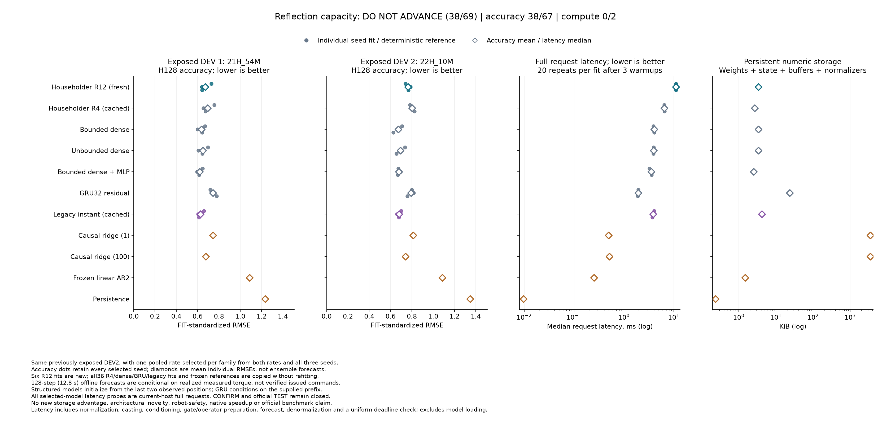

# Twelve reflections improve modestly, but dense controls still win

**The capacity candidate fails its frozen rule: 38/69 conditions, comprising 38/67 accuracy and 0/2 compute conditions.** All six fresh fits complete 4,096 updates. Twelve reflections lower selected-recipe mean error by 3.47% / 4.64% versus four reflections, below the required 5% on both development recordings. Simpler dense controls remain more accurate and substantially faster.

This capacity recipe stops here. The next comparison tests observed-history initialization of the stronger dense baseline, with an equal-size local-information control. It is a separate, now registered experiment with no outcome yet, not a demonstrated explanation of the earlier failures.

[All 184 scores and 69 conditions](robot-reflection-capacity-results/table.md) · [Results JSON](robot-reflection-capacity-results/study/results.json) · [Checkpoints and evidence](robot-reflection-capacity-results/manifest.json) · [Protocol](robot-reflection-capacity-protocol.md) · [Registration](robot-reflection-capacity-registration.json) · [Independent audit](robot-reflection-capacity-results/audit.json).

## Matched development comparison

Each request observes 32 samples and forecasts 128 samples, or 12.8 seconds, for six robot position channels. The transition candidates initialize from the last two observed positions; GRU32 also consumes the earlier prefix. Future inputs are realized measured torques. This is conditional forecasting, not verified command-driven robot control.

The six new twelve-reflection fits use the same three seeds, two learning rates, paired training windows, batch16 and 4,096 Adam updates as the closed four-reflection study. Thirty-six parent fits are retained unchanged, including both learning rates for every family. Extra reflections start in cancelling pairs, preserving the initial operator in real arithmetic and the common raw parameters exactly. Floating-point operator equality is not promised. Twelve reflections add 176 parameters and match bounded dense at 806 parameters. Depth, capacity and optimization geometry change together.

One learning rate per family is selected using pooled H128 standardized SSE across both DEV files and all three seeds. Twelve reflections, unbounded dense and GRU32 select .003; the other neural families select .001. The selected ridge penalty is 100. There is no best-seed selection or forecast ensemble.

| Model | Parameters | DEV1 RMSE | DEV2 RMSE | Request ms | Persistent numeric bytes |
|---|---:|---:|---:|---:|---:|
| Householder, twelve reflections | 806 | 0.67090 | 0.76531 | 11.078 | 3,464 |
| Householder, four reflections | 630 | 0.69500 | 0.80252 | 6.449 | 2,760 |
| Bounded dense | 806 | 0.63677 | **0.67244** | 4.028 | 3,464 |
| Unbounded dense | 806 | 0.64967 | 0.69214 | 3.952 | 3,464 |
| Bounded dense, MLP gate | 590 | **0.61832** | 0.67847 | 3.531 | 2,600 |
| GRU32 residual | 5,916 | 0.74267 | 0.79181 | 1.940 | 24,056 |
| Legacy instant scheduler, cached | 1,014 | 0.62582 | 0.67959 | 3.858 | 4,296 |
| Causal ridge, penalty 1 | 445,440 | 0.74422 | 0.81135 | 0.491 | 3,565,264 |
| Causal ridge, penalty 100 | 445,440 | 0.67545 | 0.74077 | 0.509 | 3,565,264 |
| Frozen linear AR2 | 150 | 1.08777 | 1.08615 | 0.251 | 1,536 |
| Persistence | 0 | 1.23294 | 1.34667 | 0.010 | 240 |

Errors use FIT-only standardization; lower is better. Neural values are means of three individual fit RMSEs. DEV1 is `21H_54M`, DEV2 is `22H_10M`, both recorded on the same physical robot on 2021-12-15. Both have already informed development. All per-joint errors in degrees, H64/H128 scores and both learning rates remain in the complete table.

All displayed latencies are measured again in this campaign. Timing includes normalization, conversion, conditioning, validation, transition preparation, applicable spectral norms, all forecast steps, denormalization and finite checks. Each selected fit has three warmups and twenty repetitions; neural family values are medians of three fit medians. The shared Apple M5 Max host uses one CPU thread. Storage includes parameters, buffers, explicit state and normalizers; request arrays, temporary workspace, Python objects and model/disk loading are excluded and disclosed separately.

## Interpretation

Twelve reflections improve all six selected seed/file comparisons against four reflections. However, their means remain 5.36% / 13.81% worse than bounded dense and 8.50% / 12.80% worse than the smaller MLP-gated dense control. Requests take 2.75 times bounded dense latency and 3.14 times MLP latency. There is no storage advantage over bounded dense.

Selected learning rates differ between four and twelve reflections. At the common .001 rate, twelve reflections are slightly worse on both files; at .003 they improve both. The result does not establish that reflection rank was the cause of the earlier failure. It supports only a modest selected-recipe improvement under this training budget. Products of Householder reflections also have established [prior art](https://proceedings.mlr.press/v70/mhammedi17a.html), including [DeltaProduct](https://arxiv.org/abs/2502.10297).

The cheaper dense model remains the more useful development starting point. The [prospective history experiment](robot-history-initialization-protocol.md) will compare the original initializer with equal-size affine heads using local features or older observations. Its [implementation qualification](robot-history-initialization-qualification-results/README.md) passes 145 fabricated checks; an effectiveness result is still pending. A useful prefix could encode physical state, causal-filter state or a statistical regularity; this comparison alone cannot distinguish those mechanisms.

## Evidence and limits

The pre-fit commit is `24b124bb9dac330729b79c277933ff50ac18ba66`. The original process completes in 1,600.40 seconds with 24,576 new optimizer updates. All 36 cached fits and their 147,456 historical updates remain unchanged. No fit or score fails, no deadline expires and no attempt restarts.

All 182 pre-run qualification tests and 95 integrated audit/publication tests pass. The independent saved-output audit passes on its original invocation. It reconstructs 84 neural checkpoint forecasts and eight references, all 184 score rows, learning-rate selection and every one of the 69 conditions, and agrees with the negative result. The audit uses the qualified model implementation with independent scoring and reference reconstruction; it does not independently reimplement the recurrence or rerun training.

The public package contains 451 files, including its manifest, with every initial/final checkpoint, Adam state, update trace, paired batch file, forecast, original execution receipt and source snapshots. Failed publication-fixture evidence is retained alongside its corrected checks. Exactly two measured DEV target-window payloads remain local, with their hashes published. Raw measurements remain external under the [Industrial Robot dataset's own terms](https://doi.org/10.26204/data/5).

CONFIRM and official TEST remain unopened. This is another adaptive result on exposed development recordings, not an official benchmark score, calibrated uncertainty result, biological-wiring advantage or ICLR-ready novelty claim. The separate [Rust parity failure](robot-native-results.md) also remains closed; no native speedup is established.
