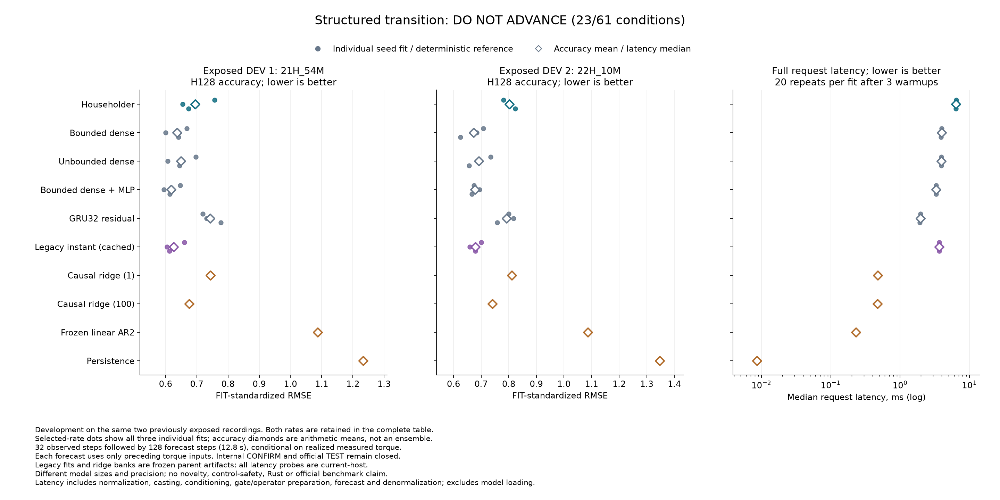

# Compact robot transitions: four reflections lose accuracy

**The Householder candidate fails its original rule: 23/61 conditions.** All 30 fresh fits complete 4,096 updates. Its forecast error is 9.15% / 19.35% above matched bounded dense transitions on the two development recordings, and its eager CPU requests take 1.61 times as long. The 20.32% storage reduction does not compensate for those losses.

The useful lead is the simpler dense model with an MLP gate. It has 590 parameters and lower mean error than GRU32, but still takes more inference time. It is an established architectural combination, not a newly validated method. Confirmation remains closed.

[All 160 scores and 61 conditions](robot-structured-results/table.md) · [Results JSON](robot-structured-results/study/results.json) · [Checkpoints and evidence](robot-structured-results/manifest.json) · [Protocol](robot-structured-protocol.md) · [Registration](robot-structured-registration.json) · [Independent audit](robot-structured-results/audit.json).

## Matched development comparison

Each request carries 32 observed samples and forecasts 128 samples, or 12.8 seconds, for six measured robot position channels. The transition models initialize from only the last two positions. GRU32 also incorporates the earlier prefix into hidden state. Future inputs are realized measured torques, not verified issued commands. This is conditional forecasting, not a robot-control or safety result.

Five fresh families share the same training windows, 4,096 Adam updates, batch 16, two learning rates and three seeds. Six unchanged legacy fits and four reference models remain in the comparison. One rate per family is selected across both DEV recordings and all three seeds; there is no seed selection or forecast ensemble. Householder, bounded dense, MLP and legacy select .001; unbounded dense and GRU32 select .003. The selected ridge penalty is 100.

| Model | Parameters | DEV1 RMSE | DEV2 RMSE | Request ms | Persistent numeric bytes |
|---|---:|---:|---:|---:|---:|
| Householder, four reflections | 630 | 0.69500 | 0.80252 | 6.418 | 2,760 |
| Bounded dense | 806 | 0.63677 | **0.67244** | 3.989 | 3,464 |
| Unbounded dense | 806 | 0.64967 | 0.69214 | 3.938 | 3,464 |
| Bounded dense, MLP gate | 590 | **0.61832** | 0.67847 | 3.313 | 2,600 |
| GRU32 residual | 5,916 | 0.74267 | 0.79181 | 1.961 | 24,056 |
| Legacy instant scheduler, cached | 1,014 | 0.62582 | 0.67959 | 3.657 | 4,296 |
| Causal ridge, penalty 1 | 445,440 | 0.74422 | 0.81135 | 0.476 | 3,565,264 |
| Causal ridge, penalty 100 | 445,440 | 0.67545 | 0.74077 | 0.471 | 3,565,264 |
| Frozen linear AR2 | 150 | 1.08777 | 1.08615 | 0.229 | 1,536 |
| Persistence | 0 | 1.23294 | 1.34667 | 0.009 | 240 |

Errors use FIT-only standardization; lower is better. Neural values are means of three individual fit errors. DEV1 is `21H_54M`, DEV2 is `22H_10M`, both from the same physical robot on 2021-12-15. Both recordings have already informed development. Per-joint errors in degrees and both H64/H128 results are retained in the full table.

Timing includes normalization, float conversion, context conditioning, validation, operator preparation, spectral norms where used, rollout, denormalization and finite checks. Each selected fit has three warmups and 20 repetitions; family values are medians of three fit medians. Measurements use one CPU thread on a shared Apple M5 Max host. Numeric storage counts parameters, buffers, explicit state and normalizers. Request inputs, outputs, Python objects, temporary workspace and model/disk loading are excluded and disclosed separately.

## What to carry forward

The four-reflection model loses all six paired-seed comparisons against bounded dense and MLP controls. It also fails the latency criterion, three per-joint safeguards and the DEV2 causal-ridge comparison. No criterion was removed after seeing these results.

The MLP-gated dense control lowers mean error 16.74% / 14.31% versus this GRU32 recipe while using 89.19% less persistent numeric storage. Its requests take 1.69 times as long. Its improvement over the archived instant scheduler is only 1.20% / 0.17%. The larger GRU32 is less accurate than the earlier GRU10 study, so more capacity did not produce a stronger empirical baseline under this fixed training recipe. These comparisons do not establish a general GRU disadvantage.

The next architecture test should isolate operator capacity: four versus twelve reflections with the same gate, forcing, initialization and training batches. Twelve reflections add 176 parameters, matching bounded dense at 806; they give up the original storage claim. This follows the rank restriction of a four-reflection product and is a new development hypothesis, not an explanation established by the current run. It requires its own registration before fitting.

Products of reflections and parameter-varying recurrences have existing precedents, including [DeltaProduct](https://arxiv.org/abs/2502.10297) and [ReLiNet](https://www.ijcai.org/proceedings/2023/385). A common norm bound constrains forced trajectories in exact arithmetic; it does not prove nonlinear contraction, accurate physics or safe control.

## Rust engineering status

The separate [native implementation qualification](robot-native-qualification-results/README.md) passes 110 fabricated tests after preserving an 88/90 first attempt. A subsequent [trained-checkpoint comparison](robot-native-results.md) fails its physical-output parity checks: all standardized forecasts and states pass, but conversion to physical units exceeds the same fixed tolerance. All 30 cases are retained and timing never starts. No Rust speedup is established, and this does not alter the original 23/61 scientific outcome.

## Evidence

The pre-fit commit is `cc8e6c81375891262c7bef54bb6aaf35006887ad`. The original run finishes in 2,373.60 seconds with 122,880 fresh optimizer updates and no failed fit or restart. Six legacy fits, including their 24,576 historical updates, are copied unchanged rather than retrained.

All 291 scientific qualification tests and 40 delivery tests pass. The independent audit passes on its first invocation, reproducing 72 neural checkpoint forecasts and eight reference forecasts, all 160 score rows, rate selection and all 61 conditions. It performs no optimizer updates. A prior qualification attempt stopped at launcher lint before tests; its log is retained.

The public package contains 379 files, including every initial/final checkpoint, Adam state, training trace, paired batch file, forecast and audit receipt. Exactly two future-position target-window files stay local; their hashes and inherited measurement descriptors remain in the manifests. The original [Industrial Robot data](https://doi.org/10.26204/data/5) retains its own licensing. Internal CONFIRM and official TEST remain unopened. This is an adaptive development result, not an official benchmark score or an ICLR-ready novelty claim.
