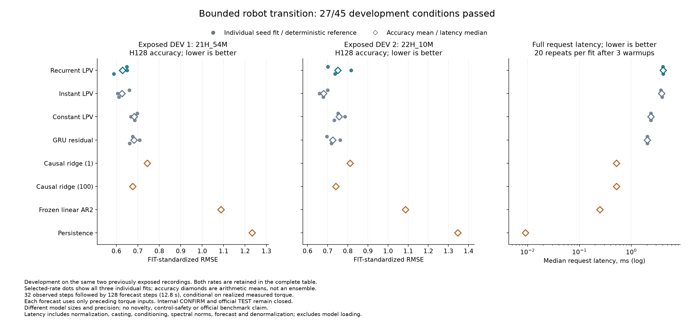

# Bounded robot transitions: memory does not pass the comparison

**The recurrent-scheduler candidate fails its advancement rule: 27/45 conditions.**
All 24 fits finish all 4,096 updates without numerical failure. The useful
development signal comes from the simpler current-state scheduler: its mean
forecast error is **8.27% / 6.36% below the freshly trained GRU** on the two
development recordings. It requires **1.90 times GRU's inference time**. These results do not
establish a new architecture or justify opening confirmation.

[All 112 scores and 45 conditions](robot-transition-results/table.md) ·
[Machine-readable results](robot-transition-results/study/results.json) ·
[Complete evidence manifest](robot-transition-results/manifest.json) ·
[Protocol](robot-transition-protocol.md) ·
[Registration](robot-transition-registration.json) ·
[Independent scoring audit](robot-transition-results/audit.json).

## Matched comparison

The models observe 32 samples and predict the next 128 samples, a 12.8-second
forecast of all six measured robot joint positions. Each forecast step uses
only torque inputs preceding that target. Inputs are realized measured torques,
not verified issued commands, so this remains an offline conditional forecast.

Four learned families receive the same FIT windows, 4,096 updates, batch size 16,
full-horizon loss and two-rate search across three seeds. One rate per family
is selected across both DEV recordings and all seeds; there is no seed selection
or prediction ensemble. All LPV variants select .001; GRU selects .003.
The selected causal ridge penalty is 100, with both penalties retained below.

| Model | Stored parameters | DEV1 RMSE | DEV2 RMSE | Request ms | Persistent numeric bytes |
|---|---:|---:|---:|---:|---:|
| Recurrent scheduler LPV | 1,014 | 0.62849 | 0.75121 | 4.106 | 4,328 |
| Current-state scheduler LPV | 1,014 | **0.62582** | **0.67959** | 3.845 | 4,296 |
| Constant-mixture LPV | 468 | 0.68353 | 0.75680 | 2.385 | 2,112 |
| Fresh GRU residual | 1,296 | 0.68225 | 0.72576 | 2.028 | 5,488 |
| Causal ridge, penalty 1 | 445,440 | 0.74422 | 0.81135 | 0.518 | 3,565,264 |
| Causal ridge, penalty 100 | 445,440 | 0.67545 | 0.74077 | 0.518 | 3,565,264 |
| Frozen linear AR2 | 150 | 1.08777 | 1.08615 | 0.247 | 1,536 |
| Persistence | 0 | 1.23294 | 1.34667 | 0.009 | 240 |

Lower RMSE is better. Neural entries are means of three individual fit errors,
standardized using FIT statistics. DEV1 is `21H_54M`, DEV2 is `22H_10M`, from the
same physical robot on 2021-12-15. They are not two independent plants. All
joint errors in degrees and both H64/H128 results are in the complete table.

The current-state scheduler resets its GRU before every transition. Its
192 hidden-to-hidden weights are inactive but remain included in storage and
parameter counts. **The 12-value dynamics state still recurs**: this is an
ablation of scheduler memory, not a memory-free world model. Constant mixing
also has lower useful capacity. These controls do not isolate every
architectural difference from GRU.

Request latency includes batch1 normalization, conversion, prefix conditioning,
spectral norms, rollout, denormalization and finite checks. Each selected fit
has three warmups and 20 measurements; the table reports the median of the three
per-fit medians. Single-thread CPU measurements came from a shared Apple M5 Max
host, not a dedicated throughput benchmark. Storage includes weights, explicit
state, buffers and normalization. Request inputs (9,216 bytes), outputs
(6,144 bytes), Python object overhead, temporary workspace and model/disk
loading are excluded from the storage figure.

## What the failure tells us

The recurrent scheduler is **0.43% / 10.54% worse** than the current-state
scheduler. It beats GRU by 7.88% on DEV1 but is 3.51% worse on DEV2. It fails the
required mean and paired-seed gains over the instantaneous scheduler, several
DEV2 comparisons, three per-joint safeguards, and the latency ceiling. Its
latency is 2.03 times GRU versus a maximum of 2.00. These are the original
conditions; none were removed after seeing the result.

The simpler scheduler has the lowest family mean error on both DEV files, but
does not beat GRU in every paired case: DEV2 seed 8101 has error 0.70023 versus
GRU 0.69622. It uses 21.72% fewer persistent numeric bytes than GRU but more
latency. It was a prespecified control, **not the registered candidate**.
Promoting it now requires a new protocol, not relabeling this failed run as a pass.

The transition is bounded under bounded forcing in exact arithmetic. This is
not a guarantee of contraction of the complete nonlinear scheduler, stable
gradients, accurate physics or robot safety. The design borrows from established
parameter-varying recurrent models such as
[ReLiNet](https://www.ijcai.org/proceedings/2023/0385.pdf). Allowing dense,
noncommuting experts under a common norm bound is not by itself a novelty claim.

The new causal ridge bank removes a weakness in the earlier quality reference:
target h can use only future_u[:h], never later torques. The old joint-horizon
ridge had access to all 128 future torques at every target. Its lower scores
cannot be used as a causally matched comparator here.

## Evidence and limits

Pre-fit source freeze: `abf55fd00ce426763969eb6a240b7f3c26f7f043`.
Registration SHA256:
`8e12dac5ef2cc6acf95bea68bd8551f3040c103e628fa52697dba0511ed1c52a`.
All 196 qualification tests pass. One original run finishes in 1,504.75 seconds,
with 24 completed attempts and 98,304 recorded optimizer updates. There is no
restart or failed fit to omit.

The post-run audit passes on its first invocation. It independently reconstructs
targets, reference predictions, all 112 scalar metric rows, rate/penalty selection
and 45 conditions. It verifies 48 exact saved neural checkpoint replays and 8
reference replays. Neural replay uses the qualified model implementation;
it is not an independently implemented recurrence. The audit does not replay
optimizer trajectories or prove a mathematical stability theorem.

All checkpoints, optimizer states, loss traces, sampled batches, predictions,
source snapshots and measured costs are retained. Two target-window arrays stay
local, with hashes retained. Parent measurements come from the
[Industrial Robot dataset](https://doi.org/10.26204/data/5); its official protocol
differs from this internal split and causal preprocessing. This repository's
license does not relicense the source measurements.

Both DEV recordings were already exposed in the
[preceding 20/55 failure](robot-coupling-results.md). All new fits finish before
DEV loading in this run, but that does not make these files untouched again.
The new fits also receive eight times the old forecast-target training exposure.
Cross-study improvements cannot be assigned solely to architecture.
Internal CONFIRM2 and official TEST remain unopened. No control policy, RL gain,
biological-wiring advantage or ICLR-ready result is established.

## Next experiment

Use the current-state scheduler as a development baseline under a new protocol.
Compare it with a compact feedforward gate and an unconstrained version of the
same transition, keeping initialization, data, loss and budget matched. That
tests whether bounded dynamics, gating or parameterization explains the gain.
Measure early forecast fidelity as well as long-horizon error.

Then remove inactive weights and qualify a faster implementation without changing
the learned function. This addresses the observed latency cost and makes a
Python/native comparison useful. A smaller implementation alone is engineering
progress, not scientific novelty. Persistent scheduler memory, graph structure
or connectome constraints need a demonstrated remaining failure to address
before another architecture expansion. Confirmation stays closed until a new
prospective development rule passes.
