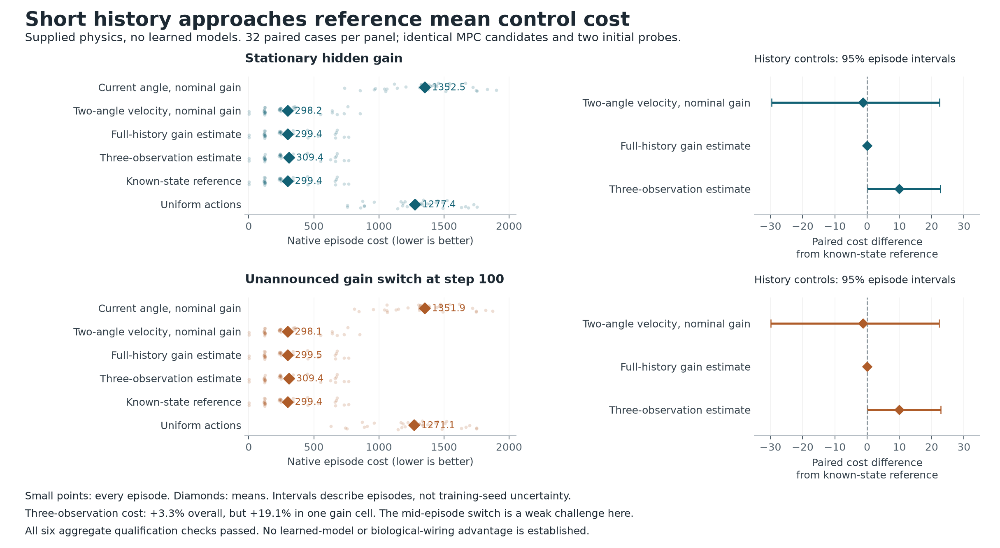

# Does this robotics task require persistent memory?

This is a supplied-physics qualification of an observation-only Pendulum task,
not a trained world model or a connectome result. It follows the
[connectome and robotics literature review](connectome-world-model-robotics-reading.md).

The question comes before architecture selection: can a short observation
window recover enough hidden state to control the system? In this noiseless
simulator, two angle observations determine angular velocity. A third can
identify constant actuator gain if the action is informative and neither
torque nor speed is saturated. A sophisticated memory model should not receive
credit for solving a task that this calculation already solves.

## Result: stop expanding this clean task

All six frozen qualification checks passed. Execution took 4.73 seconds;
the saved-output audit independently replayed **125,952 transitions**, with
zero state discrepancy and maximum reward discrepancy of `1.78e-15`.
No neural model was trained and no Astra calls were made.



| Controller | Stationary mean cost | Switched-gain mean cost |
|---|---:|---:|
| Current angle, nominal velocity/gain | 1,352.487 | 1,351.853 |
| Two-angle velocity, nominal gain | 298.186 | 298.136 |
| Full-history gain estimation | 299.428 | 299.459 |
| Three-observation gain estimation | 309.409 | 309.419 |
| Known-state reference | 299.428 | 299.442 |
| Uniform actions | 1,277.414 | 1,271.112 |

The three-observation estimator is 3.33% above the stationary reference mean
cost, within the predeclared 5% tolerance. Full-history estimation produces
exactly the same 6,400 stationary commands and state trajectories as the
known-state reference. Even the nominal-gain velocity estimator has a similar
mean cost. Its paired difference interval is `[-29.63, 22.44]`; this is not a
formal equivalence or superiority claim.

**The aggregate result is not uniform across dynamics.** Three-observation
cost is 19.06% above the reference at gain 1.2 and 9.70% above at gain 1.35.
There are only 6-7 cases per gain, and each initial state is assigned one gain,
not tested at all five. These are fixed development diagnostics, not broad
dynamics generalization.

The switch is also a weak adaptation challenge: the reference incurs only
4.296 mean cost after the switch, out of 299.442 total. Full-history commands
differ from the switched reference at 2,146 decisions, yet mean cost differs
by only 0.0172. Similar total costs therefore do not demonstrate robust
adaptation or accurate change detection.

Excited trajectories identify gain in all 256 cases for both diagnostic gains;
maximum gain error is `3.35e-6` and velocity error `1.29e-6`. Zero actions produce
identical trajectories for the two gains and identify neither. This confirms
that the estimator needs action-dependent information.

The practical conclusion is narrow: this supplied-physics task does not
justify a large persistent-memory or biological-topology comparison. It does
not rule out useful recurrence when dynamics must be learned or observations
are noisy or missing. Any such experiment needs its own motivated task and
prospective protocol; this completed run will not be made harder and rescored.

Evidence: [all cases and gain cells](../evidence/robotics-pendulum-qualification-v1/audit/summary.json),
[audit receipt](../evidence/robotics-pendulum-qualification-v1/audit/receipt.json),
[original execution receipt](../evidence/robotics-pendulum-qualification-v1/execution/completed.json),
[complete saved trajectories](../evidence/robotics-pendulum-qualification-v1/execution),
and [figure receipt](../evidence/robotics-pendulum-qualification-v1/figure-v3/receipt.json).

## Frozen comparison

The [protocol](../evidence/robotics-pendulum-qualification-v1/protocol/plan.json)
was prepared before the scored execution. Its SHA-256 is
`fd369d82e16793615f484a349af628e453e985b562d1efc0d4dc5fecec0cc58a`.
Implementation commit: `aa9352b`.

- 32 initial states, 200 steps each, six controllers, two panels: 384 episodes.
- Hidden actuator gains of 0.65, 0.8, 1.0, 1.2 and 1.35. The second panel
  changes gain to `2 - gain` halfway through an episode, without announcing it.
- Observation-based controllers receive only float32 angle cosine/sine and
  their issued command histories. All planners are supplied the same physical
  equations. The reference additionally receives true current velocity and gain.
- Compare current observation, velocity with nominal gain, full-history gain
  estimation, last-three-observation gain estimation, known-state reference and
  a uniform-action floor.
- Identical two initial probe commands and identical candidate action sequences
  for every planner. Both probes count toward episode cost.
- 64 candidate plans, a 32-step horizon and four-step action blocks. Execute
  the first action, then replan. No fitting, tuning, warm starts or terminal value.
- Separate 256-case excited-action and zero-action observability diagnostics.
- Ten-minute execution cap, no retries, replacement cases or extensions.

Lower native episode cost is better. The known-state controller uses finite
random-shooting planning, so it is neither optimal nor an upper bound on return.
Paired episode bootstrap intervals describe these cases; they do not measure
training-seed uncertainty. Gains are not distributed equally across the 32
cases, so the audit also reports each gain cell.

Short-history qualification requires all six frozen checks: within 5% of
reference mean stationary cost, at least 10% better than current-observation
control, reference at least 20% better than uniform, accurate velocity and gain
recovery, and no gain identification from zero commands. A pass rules out a
large long-memory/connectome sweep on this clean task. A failure calls for
diagnosis, not a biological-architecture claim.

The saved-output audit independently replays every physical transition through
the installed Gymnasium implementation, verifies recorded observations and
estimates, and recomputes costs and paired intervals. No new planner decisions
are made during the audit. Exact copies of all raw trajectories are published
alongside the protocol, original execution receipt and audit.

## Reproduce

Use the runtime recorded in the protocol and the exact frozen source files.
The runner rejects source or runtime changes, existing output directories and
a mismatched external plan hash.

```bash
python scripts/qualify_robotics_pendulum.py run \
  --plan evidence/robotics-pendulum-qualification-v1/protocol/plan.json \
  --expected-plan-sha256 fd369d82e16793615f484a349af628e453e985b562d1efc0d4dc5fecec0cc58a \
  --out runs/robotics-pendulum-qualification-v1/execution
python scripts/qualify_robotics_pendulum.py audit \
  --plan evidence/robotics-pendulum-qualification-v1/protocol/plan.json \
  --expected-plan-sha256 fd369d82e16793615f484a349af628e453e985b562d1efc0d4dc5fecec0cc58a \
  --execution runs/robotics-pendulum-qualification-v1/execution \
  --out evidence/robotics-pendulum-qualification-v1/audit
```

The protocol binds the original platform. A different machine needs a separate
protocol and output location; its measurements should remain a separate run.
