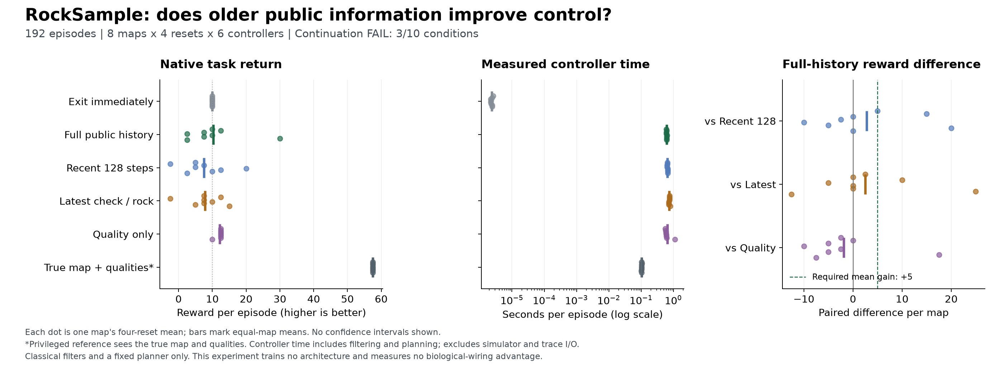

# RockSample: older memory does not earn continuation in this control screen

21 September 2026. The six-controller comparison completed **192 episodes on
eight maps**. Full public history averaged **10.3125** native reward, against
**10.0000** for immediate exit and **12.1875** for the simpler quality-only
control. **Only 3/10 predeclared conditions pass. No learned memory pilot is
admitted.** This is a classical filtering and planning experiment, with no
trained recurrent model, connectome or architecture result.

## Fixed comparison

The [protocol](rocksample-policy-value-protocol.md), implementation and input
hashes were committed as `c9865ce` before any policy-value environment calls.
The unchanged POBAX raw RockSample(11,11) task used eight fresh constructor
seeds, four reset seeds per map, and all six controllers on every case. Each
episode had the native 1,000-step horizon and a shared cap of 64 checks.
Arm order rotated across cases. Initial and transition random keys were paired;
different actions produce different histories, so observations are not paired.

All public controllers see position, noisy check readings and action history.
Every arm retains the same public rule that a sampled cell is depleted.
Rewards, true rock locations, hidden qualities and simulator seeds never enter
a public belief or planner. Full, recent-128 and latest-check controls share the
same fixed 256-map particle bank. Recent-128 retains checks from the last 128
primitive transitions, while latest retains one check per rock. Both replay
all sample events chronologically. The quality-only control keeps initial
quality probabilities but holds locations uniform, discarding induced
location-quality correlations.

The five planning arms share four reflected exploitation tours and a bounded
family of sensing bundles. They forecast undiscounted reward, reserve travel
and eventual exit, and explicitly enumerate sequential sensing outcomes. Only
the selected first exploitation macro or complete sensing bundle is committed.
The privileged reference knows the true map and initial qualities. It tests
planner capacity with additional information; it is not an optimal oracle or
a fair public-input competitor.

## All controller results

Values are means within each map and then across all eight maps. Raw native
reward is primary. Discounted reward at gamma 0.99 is secondary and was not the
planner's optimization target.

| Controller | Native reward | Discounted reward | Steps | Checks | Controller seconds |
| --- | ---: | ---: | ---: | ---: | ---: |
| Immediate exit | 10.0000 | 9.4633 | 6.50 | 0.00 | 0.00000235 |
| Full public history | 10.3125 | 0.4441 | 313.03 | 64.00 | 0.61225 |
| Recent 128 transitions | 7.5000 | 0.4389 | 288.44 | 64.00 | 0.65111 |
| Latest check per rock | 7.8125 | 1.3710 | 229.16 | 64.00 | 0.74449 |
| Quality only | 12.1875 | 7.6601 | 95.34 | 20.13 | 0.65122 |
| True map and qualities, privileged | 57.5000 | 47.7639 | 34.78 | 0.00 | 0.10340 |

All 192 episodes exited naturally. Controller time includes belief initialization,
reconstruction, assimilation, diagnostics and planning. It excludes simulator
calls, reset, trace I/O, imports, JIT and bookkeeping. The exit row measures a
tiny direct-action routine. These are whole-episode controller costs from one
CPU run, not deployment latency measurements. The same candidate limits do not
imply equal actual compute. Window replay is not an optimized implementation.

Full history consumed all 64 checks in every episode, sampled 37.875 cells on
average, and found 1.84375 good rocks versus 1.8125 bad rocks. The remaining
34.21875 samples were empty. Its additional rewards almost cancel, leaving
only 0.3125 above immediate exit. The informed reference samples 4.75 good
rocks with no bad or empty samples. This establishes capacity under privileged
information, not that a public controller can recover that information.

## Every continuation condition

| Condition | Observed | Decision |
| --- | ---: | --- |
| Full minus recent-128 reward at least +5 | +2.8125 | Fail |
| Full beats recent-128 on at least 6/8 maps | 3/8 | Fail |
| Full minus latest reward at least +5 | +2.5000 | Fail |
| Full beats latest on at least 6/8 maps | 3/8 | Fail |
| Full minus quality-only reward at least +5 | -1.8750 | Fail |
| Full beats quality-only on at least 6/8 maps | 1/8 | Fail |
| Full minus exit reward at least +5 | +0.3125 | Fail |
| Privileged minus exit reward at least +20 | +47.5000 | Pass |
| At least 90% of full planning decisions retain ESS at least 8 | 1,756/1,756 | Pass |
| Complete valid cohort | 192/192 | Pass |

The particle-ESS criterion passes, but this only measures weight concentration
within the fixed hypothesis bank. It does not prove coverage of the unknown
true map, accurate localization or correct posterior predictions. The practical
thresholds are exploratory, not significance tests. Eight maps do not establish
general benchmark performance. This raw POBAX interface hides map locations,
so these rewards should not be compared directly with standard RockSample
solvers that receive those locations.

## Verification and reproducibility

The completed run contains **30,952 native transitions and 6,177 planning
decisions**. The process exited 0 in **100.709601 suspend-inclusive seconds**;
peak worker RSS was **724,107,264 bytes**. The output uses 20,198,632 bytes.
No training updates or external model calls occurred. The preceding synthetic
qualification passed **168 tests**, including tiny exact Bayesian cases, public
input isolation, chronological depletion, episode boundaries, all ten thresholds
and late-failure preservation. These tests establish implementation behavior,
not efficacy.

The independent saved-output auditor agrees on **146,117 scalar comparisons**,
with maximum absolute difference **7.11e-15**. It joins every primitive action to
its committed plan, reconstructs depletion, returns and discounting, checks work
counts and aggregates the recorded ESS values and all ten conditions. It does
not independently rerun the simulator or Bayesian inference, establish planner
optimality, or independently measure timing. It made no environment/model calls.

- [Frozen source and cohort manifest](../output/rocksample-policy-value-v1/plan-01.json)
  and [synthetic qualification](../output/rocksample-policy-value-v1/engineering-01/qualification.json).
- [Every episode](../output/rocksample-policy-value-v1/run-01/episodes.jsonl),
  [transition](../output/rocksample-policy-value-v1/run-01/transitions.jsonl),
  [decision](../output/rocksample-policy-value-v1/run-01/decisions.jsonl), and
  [all map aggregates and conditions](../output/rocksample-policy-value-v1/run-01/summary.json).
- [Run receipt](../output/rocksample-policy-value-v1/run-01/receipt.json), SHA-256
  `551819fc5b3c48aac60a13b6a3c245290d8a9f28dc3be603a45c4efca154703f`,
  and [actual supervisor terminal](../output/rocksample-policy-value-v1/run-process-01.terminal.json).
- [Independent auditor](../scripts/audit_rocksample_policy_value.py),
  [audit receipt](../output/rocksample-policy-value-v1/audit-01/receipt.json), SHA-256
  `1708fe9f0dedee395a86ba2d22a3a2f64b626a515147d3acafcdeb32dca4f2c7`,
  and [execution witnesses](../output/rocksample-policy-value-v1/execution-witness.json).
- [Standalone figure PDF](../output/rocksample-policy-value-v1/figure-01/policy-value.pdf),
  [plotted values](../output/rocksample-policy-value-v1/figure-01/plotted-values.json)
  and [figure source](../scripts/plot_rocksample_policy_value.py).

## Research consequence

This controller family does not establish an older-memory advantage worth
distilling into a learned recurrent model. It closes with the failed thresholds
unchanged. The preceding [prediction diagnostic](rocksample-public-memory-results.md)
also remains FAIL 4/6; this separate question does not reopen it.

The gap to the informed reference leaves public state estimation and information
collection unresolved. It does not identify whether map approximation, sensing
choices or their interaction causes the poor result. Further work would first
need a separately specified public-information baseline that earns useful task
reward, rather than a larger neural network justified by this failed screen.
There is no new architecture, biological-learning, RL or ICLR novelty claim here.
