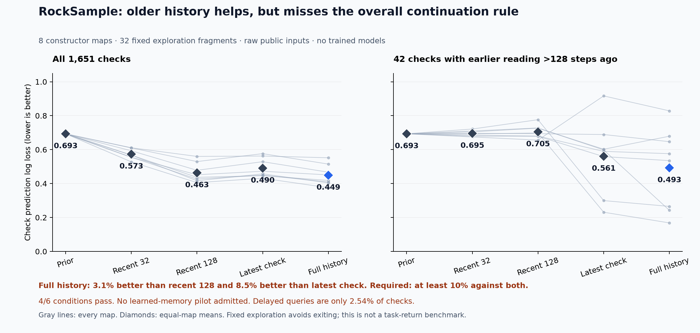

# RockSample: history helps predictions, but the learned-memory gate fails

21 September 2026. A public-history probabilistic filter reduced check prediction
log loss by **3.06% versus a 128-step window** and **8.47% versus the latest-check
control**, with positive differences on all eight constructor maps. Both gains
miss the prospectively required 10%. **Four of six conditions pass; this
collection does not admit a learned memory pilot.** No new architecture was
trained and no policy-return advantage was measured.

## What ran

The fixed diagnostic completed **32 exploration fragments, 8,192 native
transitions and 1,651 scored checks**, using eight maps and four reset seeds per
map. Its policy chooses checks with probability 0.2, samples with probability
0.2 and each direction with probability 0.15. It avoids the east exit during the
256-step fragments. This is a declared exploration distribution, not a rollout
of a trained policy or an estimate of benchmark return.

Each predictor receives only raw public position/readings and past actions.
Rewards, true rock locations, true quality bits and simulator state are not model
inputs. The factorized filter tracks an unknown location and a bad/good bit for
each rock: **2,420 probabilities**. It uses published task rules and ignores the
native map's exclusion of overlapping rocks, so it is an **approximation**, not
an exact native filter or a learned recurrent world model.

Recent-window controls use the same filter reconstructed from the last 32 or
128 completed transitions. The latest-check control retains the queried rock's
most recent check and subsequent public actions, including depletion from
sampling. It is stronger than treating a noisy latest sign as certain. Every
prediction is recorded before its target outcome is assimilated, and all five
predictors are scored on identical endpoints.

## Complete aggregate results

NLL and binary Brier scores are lower-is-better. Overall values average within
each map, then give all eight maps equal weight. No probability clipping or
post-hoc calibration was applied.

| Public-history predictor | Check NLL | Binary Brier | Delayed-check NLL |
| --- | ---: | ---: | ---: |
| Constant 0.5 prior | 0.693147 | 0.250000 | 0.693147 |
| Recent 32 transitions | 0.573395 | 0.196696 | 0.695453 |
| Recent 128 transitions | 0.463091 | 0.149070 | 0.704587 |
| Latest check and later actions | 0.490468 | 0.157609 | 0.560603 |
| Full history | **0.448920** | **0.143175** | **0.492619** |

The full filter improves overall NLL by 21.71% versus the shorter 32-step window,
but that weaker comparison is not the continuation criterion. The 128-step
window captures most of the overall improvement over the prior.

The delayed subset consists of **42 checks across all eight maps**, where the
queried rock's preceding reading was more than 128 transitions old. Its
full-history NLL is **30.08% lower** than recent-128. These are only **2.54% of all
check endpoints**. The delayed metric also gives maps equal weight; it cannot be
multiplied by the pooled endpoint fraction to attribute the aggregate gain.
This subset is descriptive, not a separate passing decision or a significance
claim. The remaining endpoint counts are 346 never previously checked, 686 with
reading age at most 32, and 577 with age 33-128.

| Frozen condition | Observed | Decision |
| --- | ---: | --- |
| At least 10% mean NLL gain versus recent-128 | 3.060% | Fail |
| Positive gain on at least 6/8 maps versus recent-128 | 8/8 | Pass |
| At least 10% mean NLL gain versus latest check | 8.471% | Fail |
| Positive gain on at least 6/8 maps versus latest check | 8/8 | Pass |
| At least 32 delayed endpoints | 42 | Pass |
| Delayed endpoints on at least four maps | 8 | Pass |

## Engineering and evidence

The [runtime qualification](rocksample-runtime-qualification-results.md)
completed first, with 19 recorded checks and 34 environment steps. It reproduced
legacy memory carry across natural episode resets and different information
under upstream factory flags. The diagnostic uses the unchanged raw RockSample
stream instead of those memory wrappers, with an independently tested public
filter. It observed no episode boundary within its exit-avoiding fragments;
episode-reset handling is covered by the separate runtime and synthetic checks.

The public filter and diagnostic passed **83 synthetic tests**, including a tiny
exhaustive filter oracle, the known approximation boundary, pre-outcome
forecasting, window edges, sampling effects, equal-map aggregation and all six
continuation conditions. The single diagnostic process exited **0** in
**11.54229225 native elapsed seconds**, with peak RSS **663,044,096 bytes**.
This includes collection, replay-based forecasts, scoring and output. It is not
a deployment latency comparison. No external model calls or training occurred.

- [Protocol fixed before collection](rocksample-public-memory-diagnostic-protocol.md)
  and [source/dependency freeze](../output/rocksample-public-memory-v1/plan-01.json),
  committed as `907c14f` before launch. The prospective collection design
  adjustment for delayed support is disclosed in the protocol.
- [All public transitions](../output/rocksample-public-memory-v1/run-01/traces.jsonl),
  [all predictions and losses](../output/rocksample-public-memory-v1/run-01/predictions.jsonl),
  and [every map, stratum and condition](../output/rocksample-public-memory-v1/run-01/summary.json).
- [Run receipt](../output/rocksample-public-memory-v1/run-01/receipt.json), SHA-256
  `ec9bfbf25334194ca798b9ba097b026756b28f3b6158ee760757c3b0b1791fe4`,
  and [actual supervisor terminal](../output/rocksample-public-memory-v1/run-process-01.terminal.json).
- [Filter source](../src/openjev/research/rocksample_public_belief.py),
  [diagnostic source](../scripts/diagnose_rocksample_public_memory.py),
  [figure PDF](../output/rocksample-public-memory-v1/figure-01/render-01/public-memory.pdf)
  and [all plotted values](../output/rocksample-public-memory-v1/figure-01/render-01/plotted-values.json).

The [independent saved-output audit](../output/rocksample-public-memory-v1/audit-01/result-01/receipt.json) agrees on **40,174 scalar comparisons**, complete transition/check coverage, every map/age aggregate and all six decisions. Maximum difference is `3.33e-16`; the gate remains **FAIL 4/6**. The audit exited 0 in 0.140 seconds and made no environment or model calls. It does not independently reproduce Bayesian prediction values, the simulator or random action generation. [Audit source](../output/rocksample-public-memory-v1/audit-01/audit.py) and [execution witness](../output/rocksample-public-memory-v1/audit-01/execution.json).

## Consequence for the architecture search

Do not add seeds, lower the threshold or promote the delayed subset to reverse
the failed gate. This collection closes as justification for a learned memory
pilot. It does establish a modest forecasting benefit from older public history
under this fixed policy, with larger differences on rare delayed queries.

RockSample's value as a control task remains unresolved. If pursued further, the
next question should be a separately frozen **classical policy-value comparison**:
use the same public-only controller and planning allocation with full versus
recent-128 belief, include simple exit and memory controls, and measure raw return
and total computation. A useful decision-level gap would be new evidence; this
prediction diagnostic supplies no such result. A learned recurrent or connectome
claim still requires matched learned controls and successful task-level evaluation.
