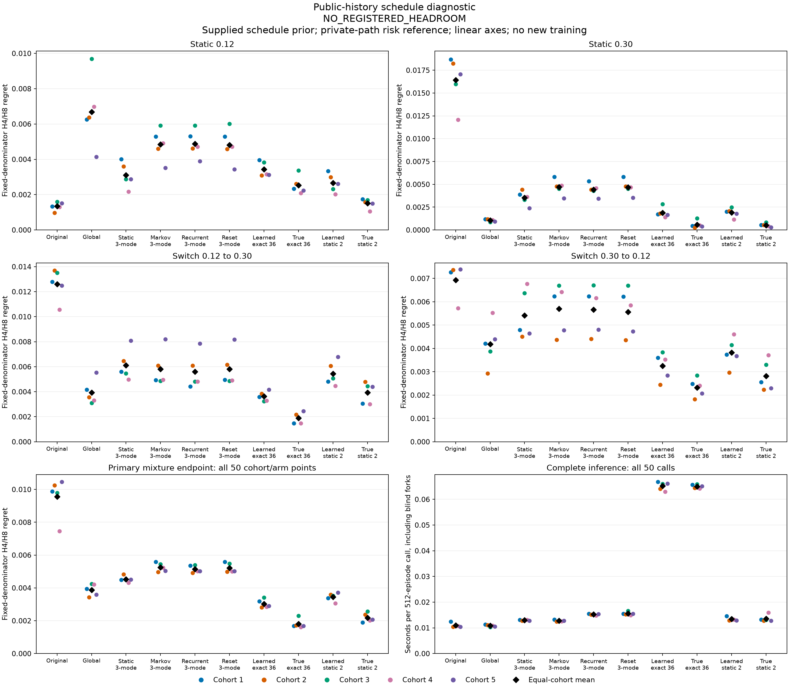

# Public-history schedule headroom

**NO_REGISTERED_HEADROOM**. Neither reference meets every frozen requirement. This label records a failed screen; it does not mean that descriptive decision improvements are absent. Overall gains cannot override the BASE-family guard or authorize an architecture advance.

Learned-field screen: **14/15**. True-field screen: **14/15**. Separate true-field history comparison: **2/2**. These are the original ordered classification rules, not a single 32-condition pass gate.

This diagnostic trains no model. It compares all six frozen reliability models with exact 36-schedule and static-two references under both learned and supplied true fields. The schedule prior is correct for the new 0.12/0.30 population; old trained controls learned on 0.12/0.48. That information advantage is intentional for diagnosing available decision improvement, and prevents a fair architecture or robustness claim.

| Reference | Overall mixture conditions | BASE guard | BASE regret | Allowed BASE ceiling |
|---|---:|---|---:|---:|
| learned_exact | 14/14 | FAIL | 0.00343017 | 0.00141159 |
| true_exact | 14/14 | FAIL | 0.00253294 | 0.00141159 |

The BASE-family ceiling is 1.05 times the unchanged control mean plus 0.000001. Passing overall-mixture gains cannot compensate for failing this separate requirement.

Primary risk divides the sum of H4/H8 regret at boundaries 8..32 by 50 for every episode, then averages all 512 episodes and the five cohorts equally. Found and later boundaries contribute zero. The divisor does not depend on survival. This differs from the parent alive-boundary endpoint, so the values are not a same-metric replication. The private-path reference has more information than public filters and is not an attainable public-information floor.

| Arm | Primary mean | Static 0.12 | Static 0.30 | Switch up | Switch down |
|---|---:|---:|---:|---:|---:|
| unchanged | 0.00956665 | 0.00134342 | 0.0164118 | 0.0126088 | 0.00693521 |
| global | 0.0038823 | 0.00668834 | 0.00103922 | 0.00393497 | 0.00418783 |
| static_bank | 0.00452499 | 0.00310627 | 0.00352647 | 0.00612453 | 0.00541859 |
| markov_bank | 0.0052576 | 0.00484576 | 0.00469395 | 0.00580459 | 0.00569914 |
| recurrent_bank | 0.00513761 | 0.00488674 | 0.00441537 | 0.00560116 | 0.00566367 |
| reset_bank | 0.00521814 | 0.00480875 | 0.0046706 | 0.00581761 | 0.00556907 |
| learned_exact | 0.00303382 | 0.00343017 | 0.00188926 | 0.0036261 | 0.00325066 |
| true_exact | 0.00180292 | 0.00253294 | 0.000575203 | 0.00190288 | 0.00232544 |
| learned_static2 | 0.00345447 | 0.00265833 | 0.00190497 | 0.00544395 | 0.00382801 |
| true_static2 | 0.00218636 | 0.00151305 | 0.000521991 | 0.00393955 | 0.00281969 |

Family columns are equal-cohort means conditional on that family; family counts vary because families are sampled independently. All four families have at least 64 episodes in every cohort.

| Candidate | Control | Candidate mean | Control mean | Relative reduction | Strict paired wins |
|---|---|---:|---:|---:|---:|
| learned_exact | unchanged | 0.00303382 | 0.00956665 | 68.29% | 5/5 |
| learned_exact | global | 0.00303382 | 0.0038823 | 21.86% | 5/5 |
| learned_exact | static_bank | 0.00303382 | 0.00452499 | 32.95% | 5/5 |
| learned_exact | markov_bank | 0.00303382 | 0.0052576 | 42.30% | 5/5 |
| learned_exact | recurrent_bank | 0.00303382 | 0.00513761 | 40.95% | 5/5 |
| learned_exact | reset_bank | 0.00303382 | 0.00521814 | 41.86% | 5/5 |
| learned_exact | learned_static2 | 0.00303382 | 0.00345447 | 12.18% | 5/5 |
| true_exact | unchanged | 0.00180292 | 0.00956665 | 81.15% | 5/5 |
| true_exact | global | 0.00180292 | 0.0038823 | 53.56% | 5/5 |
| true_exact | static_bank | 0.00180292 | 0.00452499 | 60.16% | 5/5 |
| true_exact | markov_bank | 0.00180292 | 0.0052576 | 65.71% | 5/5 |
| true_exact | recurrent_bank | 0.00180292 | 0.00513761 | 64.91% | 5/5 |
| true_exact | reset_bank | 0.00180292 | 0.00521814 | 65.45% | 5/5 |
| true_exact | learned_static2 | 0.00180292 | 0.00345447 | 47.81% | 5/5 |

The separate true_exact vs true_static2 history comparison has **5/5** strict cohort wins; means are **0.00180292** and **0.00218636**.

All 32 precommitted conditions remain visible. Each candidate must pass all 15 conditions for its own screen; the true-history pair affects only the specified branch of the classification.

| Screen | Fixed condition | Outcome |
|---|---|---|
| learned_exact | `base/unchanged/noninferiority` | FAIL |
| learned_exact | `global/mean_gain10pct` | PASS |
| learned_exact | `global/paired_wins4of5` | PASS |
| learned_exact | `learned_static2/mean_gain10pct` | PASS |
| learned_exact | `learned_static2/paired_wins4of5` | PASS |
| learned_exact | `markov_bank/mean_gain10pct` | PASS |
| learned_exact | `markov_bank/paired_wins4of5` | PASS |
| learned_exact | `recurrent_bank/mean_gain10pct` | PASS |
| learned_exact | `recurrent_bank/paired_wins4of5` | PASS |
| learned_exact | `reset_bank/mean_gain10pct` | PASS |
| learned_exact | `reset_bank/paired_wins4of5` | PASS |
| learned_exact | `static_bank/mean_gain10pct` | PASS |
| learned_exact | `static_bank/paired_wins4of5` | PASS |
| learned_exact | `unchanged/mean_gain10pct` | PASS |
| learned_exact | `unchanged/paired_wins4of5` | PASS |
| true_exact | `base/unchanged/noninferiority` | FAIL |
| true_exact | `global/mean_gain10pct` | PASS |
| true_exact | `global/paired_wins4of5` | PASS |
| true_exact | `learned_static2/mean_gain10pct` | PASS |
| true_exact | `learned_static2/paired_wins4of5` | PASS |
| true_exact | `markov_bank/mean_gain10pct` | PASS |
| true_exact | `markov_bank/paired_wins4of5` | PASS |
| true_exact | `recurrent_bank/mean_gain10pct` | PASS |
| true_exact | `recurrent_bank/paired_wins4of5` | PASS |
| true_exact | `reset_bank/mean_gain10pct` | PASS |
| true_exact | `reset_bank/paired_wins4of5` | PASS |
| true_exact | `static_bank/mean_gain10pct` | PASS |
| true_exact | `static_bank/paired_wins4of5` | PASS |
| true_exact | `unchanged/mean_gain10pct` | PASS |
| true_exact | `unchanged/paired_wins4of5` | PASS |
| True history | `mean_gain10pct` | PASS |
| True history | `paired_wins4of5` | PASS |

The exact filter maintains joint schedule/state mass and chooses actions after averaging costs. True-law filtering minimizes expected cost for this fixed additive endpoint under the supplied population prior, in expectation. It need not win each finite sample or conditional family. Learned-field exactness is conditional on its possibly wrong model. True-versus-learned contrasts combine transition, hazard, emission and cost-head mismatch; they do not identify a component or align learned coordinates to true states.

| Arm | Existing added parameters | Persistent numerical state |
|---|---:|---:|
| unchanged | 0 | 8 |
| global | 1 | 8 |
| static_bank | 0 | 24 |
| markov_bank | 4 | 24 |
| recurrent_bank | 164 | 28 |
| reset_bank | 164 | 28 |
| learned_exact | 0 | 288 |
| true_exact | 0 | 288 |
| learned_static2 | 0 | 16 |
| true_static2 | 0 | 16 |

No new parameters were fitted. Learned-field references reuse the same 352-parameter backbone in each cohort. State counts exclude fixed tables, terminal flags and temporary work. The reset GRU stores 164 parameters, but 48 recurrent entries always multiply zero; stored-size matching is not effective-capacity matching. Exact 36 filtering uses 288 joint masses versus 16 for static-two, so it is not a matched-state-memory comparison.

Five fresh cohorts each contain 512 episodes with 32 precommitted actions plus reset. All 35 original parent backbone/model files were copied before the first new scientific episode. Every first-found episode is retained. Histories use random public actions; counterfactual decisions do not control those histories. This is not autonomous control, RL or robotics evidence.

| Original phase | Native elapsed seconds | Cap seconds |
|---|---:|---:|
| qualify | 4.00705 | 180 |
| run | 10.6284 | 900 |
| audit | 3.56869 | 300 |

Original qualification passed **123 tests**, with **0 warnings**. Its 64-episode ten-reference probe scored no effectiveness metric. Inference timings include filtering and all eight blind-fork steps; they exclude model construction, surrounding torch conversions, persistence and metric calculations. Native phase times include those surrounding costs. This is one-machine elapsed time, not equal FLOPs or a speed superiority claim.

All 50 audited rows, costs and support

| Cohort | Arm | Primary | H4 | H8 | Immediate | Event NLL | Found / 512 | Family supports 0/1/2/3 | Inference s |
|---:|---|---:|---:|---:|---:|---:|---:|---|---:|
| 1 | unchanged | 0.0098745 | 0.0105163 | 0.00923269 | 0.011662 | 0.937491 | 105 | 142/139/107/124 | 0.012456 |
| 1 | global | 0.00394149 | 0.00409295 | 0.00379003 | 0.00452948 | 0.929263 | 105 | 142/139/107/124 | 0.0113141 |
| 1 | static_bank | 0.00449866 | 0.00493457 | 0.00406276 | 0.00523792 | 0.916508 | 105 | 142/139/107/124 | 0.0131743 |
| 1 | markov_bank | 0.00558992 | 0.00602449 | 0.00515536 | 0.00653683 | 0.915605 | 105 | 142/139/107/124 | 0.0132587 |
| 1 | recurrent_bank | 0.00535001 | 0.00572478 | 0.00497525 | 0.00633235 | 0.915688 | 105 | 142/139/107/124 | 0.0154601 |
| 1 | reset_bank | 0.00559492 | 0.00599942 | 0.00519042 | 0.00651924 | 0.915607 | 105 | 142/139/107/124 | 0.0155332 |
| 1 | learned_exact | 0.0031852 | 0.00337632 | 0.00299407 | 0.00340114 | 0.906014 | 105 | 142/139/107/124 | 0.0667918 |
| 1 | true_exact | 0.00167874 | 0.00173804 | 0.00161945 | 0.0016875 | 0.902686 | 105 | 142/139/107/124 | 0.0656358 |
| 1 | learned_static2 | 0.00338067 | 0.00368112 | 0.00308022 | 0.00393685 | 0.90814 | 105 | 142/139/107/124 | 0.0145719 |
| 1 | true_static2 | 0.00189107 | 0.00200311 | 0.00177903 | 0.00185687 | 0.904742 | 105 | 142/139/107/124 | 0.013252 |
| 2 | unchanged | 0.0102485 | 0.0108388 | 0.00965823 | 0.0123663 | 0.9698 | 110 | 110/120/138/144 | 0.010416 |
| 2 | global | 0.00342682 | 0.00360192 | 0.00325173 | 0.00394362 | 0.94935 | 110 | 110/120/138/144 | 0.0111288 |
| 2 | static_bank | 0.00482276 | 0.00498782 | 0.00465769 | 0.00538145 | 0.943876 | 110 | 110/120/138/144 | 0.012825 |
| 2 | markov_bank | 0.00497754 | 0.00519002 | 0.00476506 | 0.00566175 | 0.939869 | 110 | 110/120/138/144 | 0.0124656 |
| 2 | recurrent_bank | 0.00490763 | 0.00511917 | 0.00469609 | 0.00550766 | 0.93978 | 110 | 110/120/138/144 | 0.015206 |
| 2 | reset_bank | 0.00499208 | 0.00518288 | 0.00480128 | 0.00565639 | 0.939895 | 110 | 110/120/138/144 | 0.0152768 |
| 2 | learned_exact | 0.00281582 | 0.00288172 | 0.00274991 | 0.00317144 | 0.931267 | 110 | 110/120/138/144 | 0.0640752 |
| 2 | true_exact | 0.00172762 | 0.00182828 | 0.00162696 | 0.00196755 | 0.92834 | 110 | 110/120/138/144 | 0.0644012 |
| 2 | learned_static2 | 0.00359883 | 0.00373975 | 0.0034579 | 0.00398487 | 0.93567 | 110 | 110/120/138/144 | 0.0129388 |
| 2 | true_static2 | 0.00238026 | 0.00246539 | 0.00229513 | 0.00276446 | 0.932588 | 110 | 110/120/138/144 | 0.0128032 |
| 3 | unchanged | 0.00979479 | 0.0103375 | 0.00925209 | 0.0116624 | 0.935645 | 114 | 121/137/133/121 | 0.0110262 |
| 3 | global | 0.00424056 | 0.00433145 | 0.00414966 | 0.00480721 | 0.93099 | 114 | 121/137/133/121 | 0.0103125 |
| 3 | static_bank | 0.00449422 | 0.00466738 | 0.00432105 | 0.00531544 | 0.918726 | 114 | 121/137/133/121 | 0.0130314 |
| 3 | markov_bank | 0.00545001 | 0.00566328 | 0.00523674 | 0.00648467 | 0.916752 | 114 | 121/137/133/121 | 0.0129375 |
| 3 | recurrent_bank | 0.00538582 | 0.00564738 | 0.00512426 | 0.00642692 | 0.91663 | 114 | 121/137/133/121 | 0.0152687 |
| 3 | reset_bank | 0.0054778 | 0.00571236 | 0.00524324 | 0.0064016 | 0.916719 | 114 | 121/137/133/121 | 0.016582 |
| 3 | learned_exact | 0.00341381 | 0.00367306 | 0.00315457 | 0.00391497 | 0.906695 | 114 | 121/137/133/121 | 0.066004 |
| 3 | true_exact | 0.00230745 | 0.0022994 | 0.00231549 | 0.00254536 | 0.902958 | 114 | 121/137/133/121 | 0.065862 |
| 3 | learned_static2 | 0.00351636 | 0.00364825 | 0.00338448 | 0.00404835 | 0.909875 | 114 | 121/137/133/121 | 0.0135652 |
| 3 | true_static2 | 0.00256056 | 0.00268954 | 0.00243158 | 0.00275143 | 0.906139 | 114 | 121/137/133/121 | 0.0130702 |
| 4 | unchanged | 0.00745676 | 0.00763798 | 0.00727554 | 0.00831867 | 0.933823 | 112 | 134/123/144/111 | 0.0107091 |
| 4 | global | 0.00421589 | 0.00457474 | 0.00385704 | 0.00541192 | 0.930583 | 112 | 134/123/144/111 | 0.0108606 |
| 4 | static_bank | 0.00430804 | 0.00465355 | 0.00396254 | 0.00505758 | 0.918335 | 112 | 134/123/144/111 | 0.013148 |
| 4 | markov_bank | 0.0052363 | 0.00564522 | 0.00482738 | 0.00558283 | 0.916159 | 112 | 134/123/144/111 | 0.0125181 |
| 4 | recurrent_bank | 0.005025 | 0.00543764 | 0.00461237 | 0.00526995 | 0.916294 | 112 | 134/123/144/111 | 0.0148333 |
| 4 | reset_bank | 0.00500679 | 0.00532736 | 0.00468622 | 0.00538778 | 0.916293 | 112 | 134/123/144/111 | 0.0148817 |
| 4 | learned_exact | 0.00285528 | 0.0030758 | 0.00263476 | 0.00315313 | 0.907308 | 112 | 134/123/144/111 | 0.0630133 |
| 4 | true_exact | 0.00160946 | 0.00176739 | 0.00145152 | 0.00178766 | 0.90475 | 112 | 134/123/144/111 | 0.0642359 |
| 4 | learned_static2 | 0.00306481 | 0.00332941 | 0.0028002 | 0.00360071 | 0.909602 | 112 | 134/123/144/111 | 0.0132506 |
| 4 | true_static2 | 0.00202559 | 0.00213001 | 0.00192118 | 0.00221779 | 0.907391 | 112 | 134/123/144/111 | 0.015991 |
| 5 | unchanged | 0.0104587 | 0.0106656 | 0.0102519 | 0.0123998 | 0.9701 | 105 | 112/157/139/104 | 0.0104622 |
| 5 | global | 0.00358676 | 0.00372418 | 0.00344934 | 0.00416382 | 0.950367 | 105 | 112/157/139/104 | 0.010544 |
| 5 | static_bank | 0.00450126 | 0.00467739 | 0.00432512 | 0.00533435 | 0.943319 | 105 | 112/157/139/104 | 0.0128015 |
| 5 | markov_bank | 0.00503421 | 0.00510746 | 0.00496096 | 0.00545205 | 0.941897 | 105 | 112/157/139/104 | 0.012834 |
| 5 | recurrent_bank | 0.00501958 | 0.00520544 | 0.00483373 | 0.00546724 | 0.941684 | 105 | 112/157/139/104 | 0.0153992 |
| 5 | reset_bank | 0.00501908 | 0.00513676 | 0.00490141 | 0.00549547 | 0.941882 | 105 | 112/157/139/104 | 0.0154892 |
| 5 | learned_exact | 0.00289902 | 0.00293118 | 0.00286686 | 0.00333148 | 0.932757 | 105 | 112/157/139/104 | 0.0661858 |
| 5 | true_exact | 0.00169134 | 0.00175643 | 0.00162624 | 0.00179689 | 0.930087 | 105 | 112/157/139/104 | 0.065162 |
| 5 | learned_static2 | 0.00371168 | 0.00379299 | 0.00363036 | 0.00430181 | 0.935344 | 105 | 112/157/139/104 | 0.0128798 |
| 5 | true_static2 | 0.0020743 | 0.00215284 | 0.00199576 | 0.00224962 | 0.932611 | 105 | 112/157/139/104 | 0.0128239 |

The summary retains all 512 per-episode risks for every row, every family mean and all 32 conditions. The independent audit loaded 90 NPZs: 30 copied model states, five backbones, five episode files and 50 predictions. It reconstructed five private-path target populations and 20 public exact-reference outputs. It did not replay old neural gates, sampling, training or optimization. Exact-reference reconstruction is disclosed audit computation. Historical ordering remains authenticated producer evidence.

The parent reliability study remains **FAIL 8/13**. This pilot screen is conditional on five fixed backbones, not a significance test, a novel architecture, unknown-prior robustness or a revised prior verdict. Any future mechanism requires separately registered evidence and controls with matched prior/training access.

[Protocol](schedule-headroom-protocol.md) · [Full saved summary](schedule-headroom-results/summary.json) · [Archive index](schedule-headroom-results/archive-index.json) · [Member manifest](schedule-headroom-results/manifest.json) · [Publication receipt](schedule-headroom-results/receipt.json)

Archives preserve the complete current registration, source snapshot, original three native closures, qualification probes, copied states, raw episodes and all predictions. Parent archives remain externally hash-pinned. Publication reads saved audited JSON only and performs no scientific NPZ decoding, model execution or audit replay.
