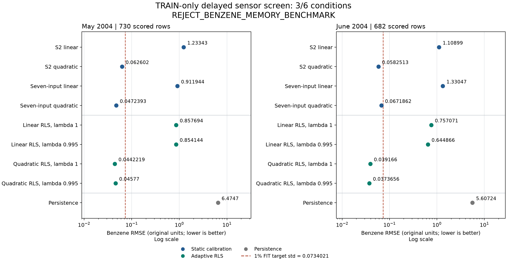

# TRAIN-only delayed sensor-memory screen

**REJECT_BENZENE_MEMORY_BENCHMARK: 3/6 conditions passed.**

This is a benchmark usefulness screen on March-June 2004 TRAIN data. It is not held-out performance or a learned-architecture result.

FIT contains 1,179 complete rows whose labels were strictly released before May 1. Seven input normalizers were fitted only on those rows. Each screen label arrived 24 calendar hours after its input; predictions were made before the current label was available. Missing hours and measurements did not shorten the delay.

The near-solution threshold is 1% of FIT target population standard deviation: 0.0734021 in original target units. Scored rows: May 730; June 682.

| Method | May RMSE | May MAE | June RMSE | June MAE | Logical bytes |
| --- | ---: | ---: | ---: | ---: | ---: |
| S2 linear | 1.23343 | 0.967542 | 1.10899 | 0.907695 | 129 |
| S2 quadratic | 0.062602 | 0.0463724 | 0.0582513 | 0.0457453 | 137 |
| Seven-input linear | 0.911944 | 0.683187 | 1.33047 | 1.15707 | 177 |
| Seven-input quadratic | 0.0472393 | 0.0367408 | 0.0671862 | 0.0516243 | 401 |
| Linear RLS, lambda 1 | 0.857694 | 0.621139 | 0.757071 | 0.601075 | 2,049 |
| Linear RLS, lambda 0.995 | 0.854144 | 0.594636 | 0.644866 | 0.489179 | 2,049 |
| Quadratic RLS, lambda 1 | 0.0442219 | 0.0347014 | 0.039166 | 0.0315673 | 12,129 |
| Quadratic RLS, lambda 0.995 | 0.04577 | 0.0339478 | 0.0373656 | 0.0301661 | 12,129 |
| Persistence | 6.4747 | 4.47288 | 5.60724 | 4.12419 | 17 |

| Frozen condition | Result |
| --- | --- |
| `fit_rows_at_least_512` | PASS |
| `may_rows_at_least_256` | PASS |
| `june_rows_at_least_256` | PASS |
| `may_static_rmse_above_1pct_fit_std` | FAIL |
| `june_static_rmse_above_1pct_fit_std` | FAIL |
| `same_rls_beats_best_static_by_10pct_both_months` | FAIL |

RLS configurations satisfying the same-configuration, both-month comparison: None.

The best static comparator is the lowest RMSE among all four static models separately in each month. Persistence is reported but excluded from that gate. A successful screen only authorizes designing a separately registered learned-memory comparison. Failure rejects this benzene-memory benchmark under the frozen rule; it does not authorize dropping a sensor, changing the target or relaxing a condition.

There is no fixed byte cap or matched-storage architecture comparison here. Each RLS model includes a 24 by 7 float64 pending-input queue (1,344 bytes), its actual dense precision/information state, duplicated normalizers, decay, clock and design tag. Python/native workspace and fit-only or audit arrays are outside this logical count. The screen makes no latency, calibrated uncertainty, novelty or generalization claim. The 24-hour delay is imposed by this experiment, not a measured analyzer latency.

No held-out numerical values were accessed. Missing labels are scored only where present; all nine methods use the same complete-input and available-target scoring rows. A strong S2 calibration fit alone would not establish how the reference target was produced.

Original run process: 1.477523 seconds. Original independent audit process: 0.660854 seconds. These are whole-process durations, not model latency comparisons. The independent audit replayed TRAIN equations from saved evidence; this presentation helper performed no array decoding, fitting or scientific replay.

Registration SHA256: `e99a649965127a6bbb4ca3b6d6cfc999ab71c73c1ef0bca382db8773751afe60`. Registered commit: `a99c05ff91bf1b29c22812065fc3dba60a0067a5`.

[Saved plotted values and all conditions](plotted-values.json) | [PDF figure](benchmark.pdf) | [Presentation provenance](plot-receipt.json)

Source: [UCI Air Quality](https://archive.ics.uci.edu/dataset/360/air+quality). Raw measurements and retained TRAIN arrays are not copied into this presentation. The source page contains conflicting license language; no unrestricted commercial-rights claim is made.
